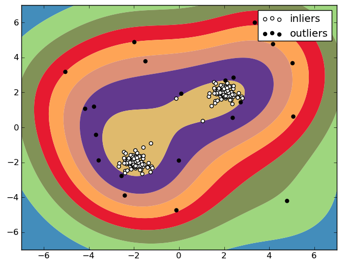
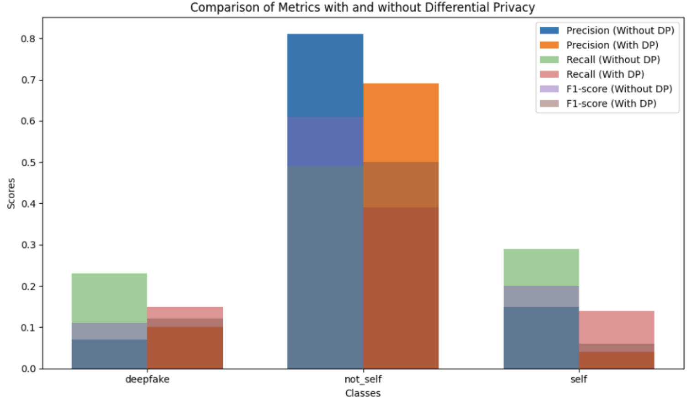
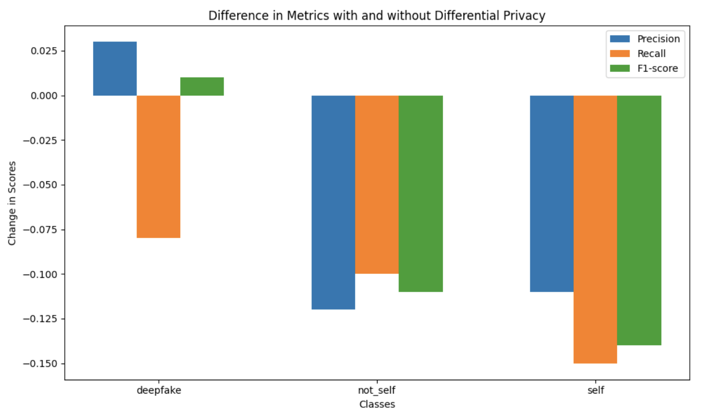
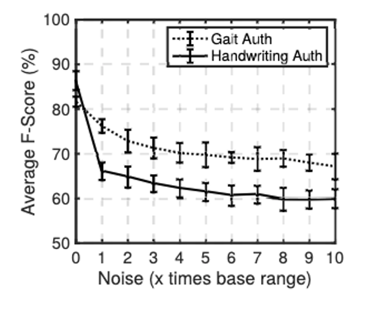

## Beschreibung der Schutzziele 
Dieses Kapitel enthält eine kurze Beschreibung der im späteren Verlauf thematisierten Schutzziele
### Robustheit
Die Robustheit eines Modells setzt sich zusammen aus der Integrität und der Verfügbarkeit des Modells. Dabei beschreibt die **Integrität** die Fähigkeit des Modells, korrekte Vorhersagen zu treffen. Diese kann durch Beeinflussung der Modell-Inputs, -Outputs sowie -Parameter beeinträchtigt werden. Die **Verfügbarkeit** von KI-Modellen ist die Sicherstellung der Funktion. Wenn ein Angreifer auf die Verfügbarkeit des Modells abzielt, veranlasst er das System dazu, gutartige Instanzen zu verweigern und dadurch nicht richtig zu arbeiten. Wenn die Ausgabe des ML-Modells in die Funktion des Systems eingebunden ist, kann dies als Denial-of-Service-Angriff betrachtet werden. 
### Privatheit
Die Privatheit bezieht sich im KI-Anwendungsbereich auf die Geheimhaltung der Trainingsdaten, auf denen KI-Modelle trainiert werden. Ein Angriff auf die Privatheit des Modells kann schwerwiegende Auswirkungen auf die Privatsphäre der betroffenen Personen haben. Im schlimmsten Fall können zum Training verwendete Daten vollständig rekonstruiert werden. 

Ein wichtiger Aspekt im Bereich der Privatheit ist die **Anonymität** in Abgrenzung zur **Pseudonymität**. Anonymität kann als der Schutz vor Identifizierung im Allgemeinen und Pseudonymität als der Schutz vor namentlicher Identifizierung definiert werden. Dies impliziert, dass bspw. zum Erreichen der Anonymität zwei Bilder nicht einander zugeordnet werden dürfen. Speziell während des Trainings von KI-gestützter Identifikation im Bereich der Biometrie kann die Anonymität nicht gewährleistet werden. Hier ist das schwächere Schutzziel der Pseudonymität zu verfolgen. Verglichen mit Anonymität hat Pseudonymität den Nachteil, dass diese ggf. durch Verbindung mehrerer Datenbanken mittels sog. Linkage Attacks umgangen werden kann. 
### Vetraulichkeit
Bei der Vertraulichkeit eines KI-Systems geht es darum, dass interne Eigenschaften und vertrauliche Informationen über ein trainiertes Modell potenziellen Angreifern verborgen bleiben. 

Ein Angriff auf die Vertraulichkeit kann es einem Angreifer ermöglichen, sensible und vertrauliche Informationen über das trainierte ML-Modell, seine Eigenschaften, Struktur und Parameter zu erlangen. Dadurch könnte der Angreifer in der Lage sein, das im Modell repräsentierte geistige Eigentum zu stehlen, gezielter zu manipulieren oder auch – basierend auf dem gewonnenen Wissen – die Privatheit der Trainingsdaten anzugreifen. 


## Beschreibung der Demonstratoren 
Innerhalb des Forschungsprojekt wurden zwei Demonstratoren entwickelt. Der Demonstrator SeamlessMe ermöglicht die Authentifizierung anhand menschlicher Gangprofile. Der Demonstrator Self-ID ermöglicht die Bestätigung der eigenen Identität mithilfe von Eyetracker-Daten. Für diese KI-Anwendungen wurde der Schutzbedarf bestimmt und die für sie vorgeschlagenen Maßnahmen und Schutzkonzepte exemplarisch implementiert sowie evaluiert. Im Folgenden werden beide Anwendungen näher beschrieben. 
### Gang-Authentifizierung (SeamlessMe) 
Der im Demonstrator “SeamlessMe” eingesetzte Machine-Learning-Algorithmus ist eine Einzelklassen-Klassifizierung (One Class Classification), die durch eine Ausreißererkennungs-Methodik (Novelty Detection) erweitert wird. Ein generischer Klassifikator (Generic Classifier) wird auf das mobile Endgerät geladen. Daraufhin lernt das Modell lokal anhand der auf dem Gerät gesammelten Benutzerdaten (User Specific Classifier). Das trainierte Modell wird dann verwendet, um ein Trust Level (Konfidenzwert) zu generieren. Die Berechnung des Vertrauensniveaus des Benutzers erfolgt lokal auf dem Smartphone und ohne Kommunikation mit einem externen Server. Sowohl das Training als auch die Inferenz finden also direkt auf dem Endgerät statt. 
### Selbstvalidierung (Self-ID) 
Bei der Demonstrator-Anwendung “Self-ID" wird ein binärer Klassifikator (Selbstbild vs. Fremdbild) auf einer Population angelernt. Dieser Klassifikator lernt anhand von Eye-Tracking-Daten zu unterscheiden, welche Klasse von Gesichtsbildern der Nutzer gerade sieht. Der Trainingsprozess findet im Vorfeld – offline – und anhand von zuvor gesammelten Trainingsdaten statt. Sollte ein persönliches Enrollment notwendig sein, wird dieses auf dem Endgerät stattfinden und das angelernte Modell wird anschließend an den Server übertragen. Die Inferenz findet online auf dem Server statt. Die Eye-Tracking-Daten werden dabei vom Client an den Server übertragen. Dieser wertet das Ergebnis aus und leitet ggf. entsprechende Maßnahmen ein.
<!-- 1920 x 1080 -->
<video width="80%" controls>
  <source src="Self-ID_SKI-BMWK_DE.mp4" type="video/mp4">
Your browser does not support the video tag.
</video>

## Maßnahmen 
### Adversarial Training 
Adversarial Retraining ist eine Schutzmaßnahme zur Stärkung der Robustheit eines Machine Learning Modells und eine Abwehrtechnik gegen sogenannte Adversarial Examples (AE). AEs sind manipulierte Inputs für neuronale Netze, welche zu einer fehlerhaften Vorhersage führen sollen. Dabei ist die Manipulation so subtil, dass sie für den menschlichen Betrachter kaum erkennbar ist. Beim Adversarial Retraining werden solche AEs mit in das Training des zu schützenden Modells aufgenommen, um dessen Integrität zu erhöhen. 

#### Szenario
Das Testen der vorgeschlagenen Sicherheitsmaßnahme geschah anhand des **Self-ID**-Demonstrators. 

Im gewählten Angriffsszenario haben subtile Änderungen an den Eingabedaten für das Modell zu fehlerhaften Ausgaben geführt. Damit wurde die Zuverlässigkeit und Vertrauenswürdigkeit des maschinellen Lernsystems verringert. Neuronale Netze wurden nicht verwendet. 

Die gezielte Manipulation von Eingabedaten durch einen “internen Angreifer” wurde durchgeführt. Auf komplexere Evasionsangriffe, wie beispielsweise das Generieren von AEs durch Generative Adversarial Networks (GANs), wurde verzichtet. Für das Beispiel musste zuerst eine ausreichend starke Verzerrung gefunden werden, sodass eine falsche Vorhersage entstand. 

Das konzipierte Angriffsszenario hatte verschiedene Voraussetzungen: 
**Zugriff auf die Eingabedaten**

Im gewählten Beispiel waren die Art und der genaue Aufbau der Eingabedaten bekannt, sodass eine verhältnismäßige simple Verschiebung der Daten als Manipulation dienen konnte.  

**Einsicht der Vorhersagen**

Für das Beispiel wurde aufgezeichnet, ab welchem Grad der Veränderung der Eingabedaten ein anderes Label vorhersagt wurde. Innerhalb der Testumgebung konnte somit nachvollzogen werden, wenn die Werte einen Schwellwert überschritten haben.  

**Beliebige Anzahl an Vorhersagen**

In der Testumgebung konnte eine beliebige Anzahl an Vorhersagen vorgenommen werden. 

#### Erfahrungswerte 
Im gewählten Beispiel wurde ein „interner“ Angreifer simuliert, welcher Zugriff auf das gesamte Projekt und die Ergebnisse der Klassifizierung hatte. Ohne das Wissen über die Auswirkungen der AEs hätten diese nicht vorhersehbar das Vorhersageergebnis verändert. Des Weiteren ist Wissen über die verwendeten Merkmale nötig, welche dem Angreifer nicht zwangsläufig zur Verfügung stehen. 

Der Erfahrungswert war, dass eine Änderung ohne ausreichendes Wissen nicht zum gewünschten Ergebnis führen kann. Je nach Systemarchitektur kann der Angreifer nicht nachvollziehen, ob seine AEs tatsächlich eine Änderung bei der Vorhersage ausgelöst haben.  

#### Implementierungshilfe 
**“Tipps & Tricks”** 

Eine Vielzahl an Beispielen und Implementierungsmöglichkeit finden sich in folgender Bibliothek: Adversarial Robustness Toolbox[^6]

**Code-Snippets**
Eingabedaten verfälschen 
```python
    perturbation_sample = sample_array + perturbation_strength
```

Auswirkungen betrachten und Vorhersagen vergleichen 
```python
    original_prediction = classifier.predict(original_sample_df)
    perturbed_prediction = classifier.predict(perturbation_sample)
```


### Anomaly Detection 
Anomaly Detection wird zur Stärkung der Robustheit eines Machine Learning Systems eingesetzt. Durch Anwendung von Anomaly Detection können kritische Inputs (wie z. B. AEs) gefiltert werden, um ungewöhnlich stark abweichende Daten-Inputs zu entfernen, die die Integrität des Modells beeinträchtigen könnten. 
#### Szenario
Das Testen der vorgeschlagenen Sicherheitsmaßnahme geschah anhand des **SeamlessMe**-Demonstrators. Das Ziel besteht darin, eine möglichst kleine Grenze zu finden, die die normalen Datenpunkte umgibt, während gleichzeitig Ausreißer außerhalb dieser Grenze liegen. SeamlessMe nutzt das Vorgehen der Anomaly Detection bereits indirekt als Authentifizierungsalgorithmus:  

Es geht darum Laufsequenzen zu erkennen, die nicht mit den zuvor trainierten Samples übereinstimmen. Ist dies der Fall, gilt die Person nicht als authentifiziert. Ebenfalls werden die zu dem Zeitpunkt (nicht-authentifiziert) aufgenommenen Daten nicht zum Training des Models verwendet. Nur wenn der Algorithmus sich sicher ist, dass die Daten zu der trainierten Person passen, werden die Daten auch zum Training verwendet. 

Für die Entdeckung von Ausreißern wurde eine One-Class Support Vector Machine eingesetzt. Eine One-Class SVM ist ein maschineller Lernalgorithmus, der in der Lage ist, Ausreißer in einem Datensatz zu erkennen. 
Im gewählten Beispiel ist nur eine Klasse von Daten vorhanden. Diese Klasse ist beim Demonstrator, die Person, welche das Handy trägt. Die abweichenden Daten oder Ausreißer sind Daten, die auf eine andere Person hinweisen und damit einer anderen Klasse zugehören.  

Das One-Class SVM konstruiert eine Entscheidungsgrenze um die “normalen” Datenpunkte, sodass ein Bereich begrenzt wird, welcher als “normales” Gebiet gesehen werden kann. Alle Datenpunkte außerhalb dieses Bereiches werden als Außenseiter (outliers) betrachtet. Eine Veranschaulichung dieser Unterscheidung wird im Folgenden gezeigt: 



*Abbildung 1: One-Class SVM [^1]*

Für **Self-ID** wurde die Anomaly Detection vorgeschlagen, aber final nicht implementiert, weil der Aufwand für den Forschungsprototypen zu hoch war. Für die Datenaufnahme war die Datenbereinigung ausreichend und Erkennung von Anomalien nicht notwendig. Für das finale Produkte sollte der Vorschlag wieder aufgegriffen werden. 

#### Implementierungshilfe 
**“Tipps & Tricks”** 

Verwendete SVM-Parameter: 

- Kernel: Gaussian Radial Basis Function (RBF) 

- Kernel-Funktionen: "Polynomial" und "Sigmoid" nicht verwendet 

Das Gamma beschreibt den Kernel-Koeffizienten. Der Gamma-Parameter bezieht sich auf $ \frac{1}{2*\sigma^2} $ der Formel: $ K(x_i,x_j) = exp(-\frac{\| x_i - x_j \|^2}{2*\sigma^2}) $

**Code-Snippet** 
(Python: Initialisierung One-Class-SVM) 
```python
    from sklearn.svm import OneClassSVM

    OneClassSVM.__init__(self, kernel='rbf', degree=3, gamma='scale')
```

### Data-Sanitization 
Die Data Sanitization der Input-Daten ist eine Maßnahme zur Verbesserung der Robustheit. Dabei werden zum Beispiel unvollständige Daten bereinigt oder entfernt, um alle Daten in die passende Form zu bringen.   

Data Sanitization der Output-Daten ist hingegen dem Schutzziel der Privatsphäre zuzuordnen. Hierbei werden sensible Output-Daten vor deren Ausgabe gefiltert. Als sensibel gelten Daten, wenn sie Rückschlüsse auf die Trainingsdaten des Modells zulassen. Ein Beispiel dafür wären die Konfidenzwerte pro Klasse im Falle von Klassifizierung. Diese können von Angreifern genutzt werden, um stärkere Privacy-Angriffe durchzuführen. Stattdessen wird nur die Klasse mit dem höchsten Konfidenzwert ausgegeben.   
#### Szenario
Unbrauchbare oder fehlerhafte Daten werden gefiltert. Für den Demonstrator **Self-ID** werden somit falsche Bilder oder Aufnahmen, welche ein Blinzeln beinhalten, entfernt. Die Filterung beinhaltet ebenfalls die Entfernung von nicht benötigten Daten, aus den Daten des Eyetrackers. Die Daten werden normalisiert und skaliert. Ein Teil der Output-Daten sind die Konfidenzwerte, die ausgegeben werden.  Die Konfidenzwerte werden ausschließlich in Prototyp-Phase im Videoclient gezeigt. Im fertigen Produkt soll die Stärke des Vertrauens im Videoclient für den betrachteten Videoanrufteilnehmer abstrakter gezeigt werden.	 

Bei **SeamlessMe** ist eine Activity Recognition des Authentifizierungsmodels vorgeschaltet. Nur Daten, die dem Laufmuster eines Menschen entsprechen, werden für die Gang-Authentifizierung verwendet. Dadurch wird bereits eine Data Sanitization der Input-Daten durchgeführt. 

#### Erfahrungswerte 
**Data Sanitization der Input-Daten**  

Eine Erfahrung, die gemacht wurde, beinhaltet die Annäherung an den korrekten Schwellwert für die Filterung. Dabei sollte beachtet werden, dass keine Trainingsdaten entfernt werden, welche noch genug Aussagekraft haben, obwohl ein kleinerer Teil invalide ist. 	 
Für das Ermöglichen der Vergleichbarkeit im Rahmen des Demonstrators Self-ID wird eine minimale Anzahl an Datenpunkten vor dem Präsentieren eines Bildes und eine minimale Anzahl an Datenpunkte nach dem Präsentieren des Bildes errechnet. Datenpunkte, die aus diesem Fenster fallen, werden entfernt, sodass alle Versuche gleich lang sind. Die minimale Anzahl der Datenpunkte beschreibt den kürzesten Zeitraum, der die Aufnahme nicht verfälscht. Die Unterschiede der Aufnahmen ergeben sich aus der Latenz des Eyetrackers. 

**Data Sanitization der Output-Daten** 		 

Wie im Abschnitt “Szenario” beschrieben, wird für die Interpretation der Ergebnisse der Modellerstellung eine Protokollierung der Ergebnisse der Modelle benötigt. Jeder Durchlauf mit verschiedenen Parametern wurde protokolliert und abgelegt. Die Log-Dateien beschreiben die Veränderungen der Leistungsmetriken, welche durch die Veränderung der Eingabeparameter verursacht werden	. 
Diese Protokollierung beinhaltete die Konfidenzwerte aller Klassen. Für die Optimierung der Modelle war eine Übersicht dieser Werte von Nöten. Für die später fertige Anwendung werden die Werte nicht mehr mitgeliefert, sodass keine Rückschlüsse auf die Trainingsdaten des Modells zugelassen werden.  Sinnhaft ist ein Feedback zwischen Benutzer und Anwendung, wenn ein Vertrauensniveau zurückgegeben werden soll. Ein Beispiel dafür ist, dass innerhalb der Demonstratoren, die Erkennung von Klassen gekennzeichnet werden sollte.
#### Implementierungshilfe 
**“Tipps & Tricks”** 

Innerhalb des Forschungsprojekts wurde mit Zeitreihen gearbeitet. Eine Art der Datenbereinigung ist die Normalisierung von Daten. In diesem Themenbereich hat sich die Quelle Normalization and Bias in Time Series Data[^2] von Aishwarya Asesh bewährt

**Code-Snippet** 
```python
    def normalize(x):
        minimum = np.min(x)
        maximum = np.max(x)
        y = (x - minimum) / (maximum - minimum)

        return np.array(y)
```

### Differential Privacy
Differential Privacy (DP) ist eine populäre Metrik, mit welcher der Einfluss einzelner Daten auf das Ergebnis einer Datenverarbeitung bemessen wird. Dies entspricht gleichzeitig dem Privatsphäreverlust der Personen, zu denen die Daten gehören. Der Privatsphäreverlust wird durch das Hinzufügen von Rauschen in der Datenverarbeitung begrenzt. Ursprünglich kommt DP aus dem Bereich Datenbanken, wird aber seit einigen Jahren auch für Privatsphäre bewahrendes ML benutzt.  
#### Szenario
Differential Privacy wurde innerhalb des **Self-ID**-Demonstrators erprobt, um festzustellen welche Auswirkungen Rauschen auf die Vorhersagequalität hat.  

Für die Betrachtung der Auswirkungen von Differential Privacy (DP) wurde eine öffentlich verfügbare Bibliothek verwendet. Diffprivlib[^3] ist eine allgemeine Bibliothek zum Experimentieren, Untersuchen und Entwickeln von Anwendungen im Bereich der differentiellen Privatsphäre. 
#### Erfahrungswerte 
Der Einfluss von Differential Privacy führte bei allen betrachteten Klassen zu einer Verringerung der Werte der Metriken. Precision, Recall und F1-Score haben bei allen Klassen abgenommen. Der Einsatz von Differential Privacy kann mit dem Hinzufügen von Rauschen verglichen werden, sodass eine Abwägung zwischen Vorhersagequalität und Schutz vorgenommen werden muss. Zu viel Rauschen kann die Genauigkeit der Vorhersagen beeinträchtigen, während zu wenig Rauschen die Privatsphäre gefährdet.



*Abbildung 2: Unterschiede der Metriken*

Das Verrauschen von Eingabedaten wird kritisch betrachtet. Hierbei wird auf das Paper 
*"Jekyll and Hyde: On The Double-Faced Nature of Smart-Phone Sensor Noise Injection"* verwiesen. Dabei wird die Verrauschung von Smartphone-Sensordaten beobachtet, die für die Authentifizierung der Gangart verwendet werden. 

Der Einfluss von “Geräuschinjektion auf die durchschnittlichen F-Scores, die für die gangbasierte Authentifizierung erzielt werden” kann folgendem Graph aus dem Paper entnommen werden:



*Abbildung 3: Einfluss von Differential Privacy*

Dabei kann gezeigt werden, wie sich der F-Score signifikant senkt, wenn mehr Rauschen hinzugefügt wird. Für die Funktionalität von SeamlessMe ist eine hohe Genauigkeit wichtig, sodass eine Person mit hoher Wahrscheinlichkeit wiedererkannt werden kann.
#### Implementierungshilfe 
**“Tipps & Tricks”** 

Zur Veranschaulichung der Ergebnisse wird die Nutzung von matplot empfohlen, wie es in den oberen Diagrammen exemplarisch zu sehen ist. 

 

**Code-Snippet** 

Beispieleinsatz der Differential Privacy Bibliothek  

```python
    from diffprivlib.models import GaussianNB

    clf = GaussianNB()
    clf.fit(X_train, y_train)

    clf.predict(X_test)
```

### Geräteattestierung 
Bei der Geräteattestierung wird die Integrität eines Gerätes (z. B. eines Smartphones) durch eine kryptografische Signatur einer vertrauenswürdigen Komponente – z. B. Trusted Execution Environment (TEE), Secure Element (SE) – bestätigt. Die dafür eingesetzten technischen Mechanismen unterscheiden sich je nach Implementierung, generell soll jedoch bestätigt werden, dass das Gerät sich in einem bestimmten Zustand befindet, der als nicht kompromittiert angesehen wird. Geräteattestierung kann beispielsweise genutzt werden, um Eingaben von kompromittierten Geräten abzulehnen und somit die Robustheit eines ML-Systems zu stärken. 

Diese Schutzmaßnahme wurde im Rahmen der Demonstratoren des Verbundprojektes SENSIBLE-KI nicht implementiert, da nur einer der Demonstratoren eine netzwerkbasierte Architektur hat, welche den Einsatz der Geräteattestierung begründen würde. Der Client für diesen wurde jedoch zunächst als Desktop-Applikation implementiert. Da im Projektrahmen keine Schutzmaßnahmen für Desktop Geräte untersucht wurden und eine Geräteattestierung nach unserem Kenntnisstand nicht üblich ist, konnte diese Schutzmaßnahme bei keinem der Demonstratoren sinnvoll eingesetzt werden. 
### Datenattestierung 
Wie bei der Geräteattestierung wird auch bei der Datenattestierung eine kryptografische Signatur einer vertrauenswürdigen Komponente verwendet. Diesmal wird jedoch die Signatur über ein bestimmtes Datum berechnet und attestiert, dass dieses bestimmte Eigenschaften hat (z.B., dass die Daten aus einer bestimmten Hardware stammen). Auch diese Form der Attestierung wird zur Stärkung der Robustheit eingesetzt. 

Diese Schutzmaßnahme wurde im Rahmen der Demonstratoren des Verbundprojektes SENSIBLE-KI nicht implementiert, da keine Daten von externen Sensorknoten oder Mobilgeräten gesammelt werden, welche attestiert werden könnten, und die Maßnahme zusätzlich nur von spezifischer Hardware umgesetzt werden kann, die für die Entwicklung der Demonstratoren nicht sinnvoll eingesetzt werden konnte. Die Evaluierungen der Maßnahme im Rahmen von AP2 zeigte jedoch eine erhöhte Latenz bei der Datensammlung, welche die Maßnahme je nach Art der Datensammlung der ML-Anwendung unpraktikabel machen könnte. 
### Modell-Signatur 
Bei Modellupdates über das Netzwerk sollte durch Signatur des Modells sichergestellt werden, dass der Empfänger das korrekte Modell erhalten hat. Die Signatur wird vom Sender erstellt und auf dem Endgerät vor der Ausführung geprüft. Besonders bei kritischen Anwendungen ist die Durchführung der Attestierung und Signatur mittels einer vertrauenswürdigen Komponente sinnvoll. Diese Maßnahme stärkt die Robustheit des ML-Systems. 

Diese Schutzmaßnahme wurde im Rahmen der Demonstratoren des Verbundprojektes SENSIBLE-KI nicht implementiert, da bei keiner der beiden Anwendungen geplant ist, Modell-Updates über das Netzwerk zu übertragen. Die früher im Projekt erfolgten Evaluierungen der Maßnahme ergaben eine erhöhte Latenz beim Start der Anwendung, deren Länge stark von der zur Signatur und Verifikation genutzten Hardware abhing. Weiterhin ist zu beachten, dass zur Implementierung dieser Maßnahme in einem TEE das Implementieren und Ausführen einer eigenen Trusted Application notwendig wäre, was auf den üblichen Mobilgeräten beispielsweise aktuell nicht ohne weiteres möglich ist.
### Verschlüsselung der Output-Daten 
Eine Maßnahme zur Verbesserung der Privatsphäre ist das Verschlüsseln von personenbezogenen Output-Daten vor der Übertragung oder Speicherung. Besonders bei hohem Personenbezug ist es empfehlenswert, zur Verschlüsselung eine vertrauenswürdige Komponente zu nutzen, da diese einen besseren Schutz für das verwendete Schlüsselmaterial bietet. 
#### Szenario
Die Verschlüsselung wurde innerhalb des **SeamlessMe**-Demonstrators erprobt. 

**Ablegen von Schlüsselmaterial** 

iOs: 

Das Schlüsselmaterial wird in der Secure Enclave gespeichert. Die Secure Enclave ist eine abgesicherte Hardwarekomponente. Dieser isolierte Bereich im Prozessorchip dient als Sicherheit und Schutz sensibler Daten. 

Android: 

Das Schlüsselmaterial wird in der hardwaregestützter Keystore gespeichert. Der hardwaregestützter Keystore ist eine physische Hardwarekomponente, die für die sichere Speicherung von kryptografischen Schlüsseln und sensiblen Daten verantwortlich ist.	 
Nicht auf allen Geräten die kryptografischen Algorithmen unterstützt, die für die Absicherung der Kommunikation benötigt werden. Dies wird bei der Implementierung einen Mehraufwand darstellen. 
#### Erfahrungswerte 
**Korrekte Wahl von Verschlüsselungsalgorithmen:** 

Die Wahl eines robusten Verschlüsselungsalgorithmus wie AES oder RSA steht in Abhängigkeit mit dem gewünschten Sicherheitsniveau.  

**Schlüssellänge und Schlüsselverwaltung:** 

Es wird empfohlen eine angemessene Schlüssellänge zu wählen, da eine längere Schlüssellänge eine höhere Sicherheit bietet. Die genutzten Schlüssel sollten ebenfalls sicher verwaltet werden und nur autorisierten Personen zugänglich sein. Regelmäßiges Rotieren der Schlüssel wird ebenfalls empfohlen.  

**Keine Performanceeinbußen** 

Die im Verhältnis kleineren Datenmengen im Projekt führten nicht zu Leistungseinbußen.
#### Implementierungshilfe 
Für das Erweitern der Recherche und bei Bedarf nach aktuellen Beispielen wird die Dokumentation zum Android Keystore System[^4] und der iOS Secure Enclave[^5] empfohlen.

### Inferenz in TEE 
Eine Möglichkeit, die Schutzziele der Vertraulichkeit, Robustheit und der Privatsphäre zugleich umzusetzen, ist die Ausführung der Inferenz einer ML-Anwendung innerhalb eines Trusted Execution Environments als sogenannte **Trusted Application**. Somit käme das fertig trainierte Modell nicht in Kontakt mit potenziell bösartigen Drittapplikationen und wäre selbst bei kompromittiertem Betriebssystem geschützt. Diese Maßnahme ist leider aktuell noch nicht praktisch umzusetzen ohne hohe technische Hürden und signifikante Performance-Einbußen.  

Die Schutzmaßnahme wurde dementsprechend im Rahmen der Demonstratoren des Verbundprojektes SENSIBLE-KI nicht implementiert. 

[^1]: https://scikit-learn.sourceforge.net/0.6/auto_examples/svm/plot_oneclass.html
[^2]: https://link.springer.com/chapter/10.1007/978-3-031-11432-8_8 
[^3]: https://github.com/IBM/differential-privacy-library
[^4]: https://developer.android.com/privacy-and-security/keystore
[^5]: https://support.apple.com/de-de/guide/security/sec59b0b31ff/web
[^6]: https://adversarial-robustness-toolbox.readthedocs.io/en/latest/ 
