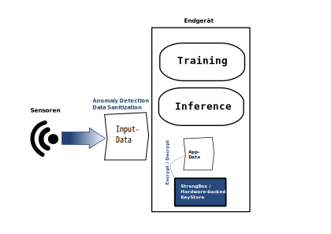
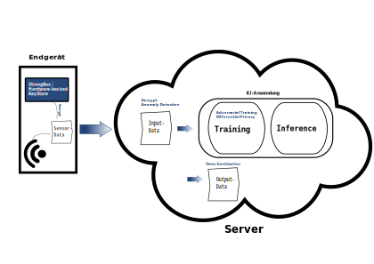

# Schutzmaßnahmen der Prototypen und Anwendungsszenarien

## 1. Einleitung
Im Folgenden werden softwarebasierte Schutzmaßnahmen sowie Verfahren aus dem Bereich des Trusted Computing vorgeschlagen, um den Schutz vor Angriffen auf KI-Anwendungen auf mobilen und eingebetteten Geräten zu verbessern.  

Zu Beginn werden in Kapitel [2. Betrachtete Maßnahmen](#2-betrachtete-maßnahmen) alle in diesem Dokument betrachteten Maßnahmen mit ihrer jeweiligen Schutzwirkung in einer Übersicht vorgestellt. Im darauffolgenden Kapitel [3. Schutzmaßnahmen nach Anwendungs-Charakteristiken](#3-schutzmaßnahmen-nach-anwendungs-charakteristiken) werden diese Schutzmaßnahmen zunächst generisch für Anwendungen mit spezifischen Anwendungscharakteristiken vorgeschlagen. Danach werden auf Basis dieser generischen Vorschläge Schutzkonzepte für zwei konkrete Anwendungen, die im Rahmen des Projektes SENSIBLE-KI entwickelt werden – “SeamlessMe” und “Self-ID” – in Kapitel [4. Referenzarchitekturen](#4-referenzarchitekturen) vorgestellt.  

Die vorgeschlagenen Maßnahmen und Schutzkonzepte sind jeweils **zusätzlich** zu Verfahren der allgemeinen System- und Anwendungssicherheit (bspw. TLS-Verschlüsselung bei Netzwerkkommuni-kation) zu betrachten, welche nicht im Scope dieses Verbundvorhabens liegen. 

## 2. Betrachtete Maßnahmen
Die hier betrachteten Maßnahmen sind entweder dem Bereich softwarebasierter Schutzmaßnahmen oder den Trusted-Computing-Verfahren zuzuordnen. In diesem Abschnitt werden zur Übersicht alle betrachteten Maßnahmen zusammen mit der erzielten Schutzwirkung und anderen nennenswerten Effekten aufgelistet. 
### 2.1 Softwarebasierte Maßnahmen
| Maßnahme | Schutzwirkung | Kommentar |
| ----------- | ----------- | ----------- |
| Adversarial Training | Robustheit | <ul><li>verringerte Accuracy</li><li>nachteilig für Privatheit</li></ul> |
| Anomaly Detection  | Robustheit | <ul><li>erhöhte Latenz und zusätzliche Kommunikation</li><li>zusätzliche Hardware/Geräte oder Speicherplatz erforderlich</li></ul> | 
| Data-Sanitization (Input-Daten)  | Robustheit | | 
| Data-Sanitization (Output-Daten)  | Privatheit | <ul><li>verringerte Accuracy und Fairness</li></ul> | 
| Differential Privacy  | Privatheit | <ul><li>verringerte Accuracy und Fairness</li><li>nachteilig für Robustheit</li></ul> | 

### 2.2 Trusted Computing
| Verfahren | Schutzwirkung | Kommentar |
| ----------- | ----------- | ----------- |
| Remote/Device-Attestierung  | Robustheit | <ul><li>technische Voraussetzungen an Gerät</li></ul> |
| Daten-Attestierung (z. B. externe Sensordaten)  | Robustheit | <ul><li>hohe Latenz</li><li>für Input-Sensordaten spezifisches Setup mit SE notwendig</li></ul> | 
| Modell-Signatur | Robustheit | <ul><li>benötigt eigene Trusted Application</li><li>erhöhte Latenz beim Start der Anwendung</li></ul> | 
| Verschlüsselung der Output-Daten | Privatheit | <ul><li>zusätzliche Latenz gegenüber nicht TC-basierter Verschlüsselung</li></ul> | 
| Inferenz-Ausführung in TEE | Vertraulichkeit, Privatheit, Robustheit  | <ul><li>sehr hohe Umsetzungshürden</li><li>benötigt eigene Trusted Application</li><li>je nach Umsetzung starke Performance-Einbußen</li><li>nur für eingebettete Anwendungen</li></ul> |  

## 3. Schutzmaßnahmen nach Anwendungs-Charakteristiken
Im Folgenden werden die Anwendungsszenarien anhand der Architekturmerkmale der KI-Systeme in zwei abstrakte Gruppen unterschieden: **netzwerkbasierte Anwendungen** (wie P2P-Netzwerke oder die klassische Server-Client-Architektur) und **End-Node-Only-Anwendungen** – also Architekturen, die auf ein Endgerät begrenzt sind. Bei netzwerkbasierten Architekturen ist ein regelmäßiger Austausch von Daten oder (im Falle von OTA-Updates) des Modells selbst über ein Netzwerk erforderlich. End-Node-Only-Architekturen sind hingegen auf ein Endgerät begrenzt und der Austausch mit einem anderen Gerät beschränkt sich maximal auf Informationen, die nicht mit dem KI-Anteil der Anwendung in Verbindung stehen. 

Da sich die zwei Architekturtypen hauptsächlich in der Notwendigkeit des Austauschs über das Netzwerk unterscheiden, werden generelle Maßnahmen für KI-Anwendungen mit bestimmten Charakteristiken im Allgemeinen und zusätzliche für netzwerkbasierte Architekturen empfohlen. Für eine spezifische Anwendung kann dann anhand der Charakteristiken die Schnittmenge aller vorgeschlagenen Schutzmaßnahmen für die Anwendung bestimmt werden.  

**Dabei ist zu beachten, dass softwarebasierte Schutzmaßnahmen für Privatheit und Robustheit sich gegenseitig negativ beeinflussen.** Das heißt, dass softwarebasierter Privatheitsschutz die Robustheit beeinträchtigt und umgekehrt softwarebasierter Robustheitsschutz sich negativ auf die Privatheit auswirkt. Daher muss im Einzelfall abgewogen werden, welches Schutzziel wichtiger ist bzw. ob eine ausreichende Schutzwirkung mit ausschließlich hardwarebasierten Maßnahmen erreicht werden kann. Weiterhin sind alle **Schutzmaßnahmen, die die Ausführung des *eigenen Codes* innerhalb eines Trusted Execution Environments (TEE) erfordern, zurzeit für mobile Anwendungen nicht umsetzbar**. Diese Beschränkung liegt daran, dass jegliche Applikationen, die im TEE ausgeführt werden sollen, zusammen mit dessen Code kompiliert werden müssen. Es ist deshalb zum heutigen Zeitpunkt wenigen, meist nur den herstellereigenen System-Apps möglich, Code im TEE des Mobilgerätes eines Nutzers auszuführen.  
### 3.1 Maßnahmen nach Quelle der Inputdaten:
Bei der Nutzung *eigener, vertrauenswürdiger Inputdaten* wird zur Verbesserung der Robustheit und der allgemeinen Accuracy die Durchführung von Data Sanitization empfohlen, um fehlerhafte oder unvollständige Daten zu bereinigen oder zu entfernen und alle Daten in die passende Form zu bringen, z. B. durch Normalisieren.  

Im Falle *nicht vertrauenswürdiger Inputdatenquellen* sollte zusätzlich Adversarial Training eingesetzt werden, um die Robustheit des Systems zu stärken. Außerdem sollten mittels Anomaly Detection manipulierte Trainings- und Inferenzdaten zum Schutz vor Data Poisoning bzw. Adversarial Attacks erkannt und entfernt werden, falls die zusätzlich benötigten Ressourcen zur Verfügung stehen. Dies gilt *insbesondere für Systeme mit deutlichem Schadenspotential*, ist aber in jedem Fall wünschenswert. 

Bei Nutzung *externer Sensordaten auf einem System mit deutlichem Schadenspotential*, die über ein nicht vertrauenswürdiges Medium (z. B. aber nicht ausschließlich das Netzwerk) übertragen werden, kann **durch ein Secure Element (SE)** eine **Attestierung der Sensordaten** – direkt beim Auslesen des Sensors – durchgeführt werden. Zusätzlich sollten Angriffe über die Inputdaten, wie eingangs beschrieben, durch **Adversarial Training** und **Anomaly Detection** abgefangen werden. 

### 3.2 Maßnahmen nach Personenbezug und Vertraulichkeit
Werden *personenbezogene Daten* oder *sensible Daten* im Allgemeinen verarbeitet, sollte die Privatheit des Modells gestärkt werden. Dies ist z. B. möglich durch den Einsatz von **Differential Privacy** während des Trainings und **Data Sanitization der sensiblen Output-Daten**. 

Bei *deutlichem Schadenspotential und/oder direktem Personenbezug der Daten und/oder hoher Vertraulichkeit* des Modells sollte die **Ausführung der Inferenz innerhalb eines Trusted Execution Environments (TEE)** in Erwägung gezogen werden. Die konkrete Umsetzung dieser Schutzmaßnahme ist jedoch mitunter – je nach Ansatz – mit einigen nachteiligen Effekten (wie erhöhten Latenzen, Strom- und Speicherverbrauch) und technischen Hürden verbunden. Außerdem muss darauf geachtet werden, dass die zu schützenden Daten nie unverschlüsselt das TEE verlassen. Lässt sich dies nicht verhindern, ist die Maßnahme nicht mehr zum Schutz der Privatheit und lediglich zur Erhöhung der Robustheit und zum Schutz der Vertraulichkeit des Modells bei Ausführung auf dem Endgerät geeignet.  

### 3.3 Spezifische Maßnahmen für netzwerkbasierte Architekturen
Bei einer Server-Client-Architektur oder anderen **netzwerkbasierten Architekturen** werden Daten und/oder Modellupdates über das Internet übertragen. Bei dieser Architekturform ist es deshalb – je nach Schutzbedarf – ratsam, zusätzlich zur allgemeinen Anwendungssicherheit, Maßnahmen gegen Manipulationen auf dem Übertragungsweg zu treffen. Alle hier genannten Maßnahmen können generell auch ohne den Einsatz von Trusted Computing umgesetzt werden – sind dadurch jedoch angreifbarer, verursachen allerdings auch geringere Latenzen. Es ist also nach der Auswahl der Maßnahmen noch einmal abzuwägen, wann eine Nutzung von Trusted Computing zur Umsetzung dieser sinnvoll und angemessen ist. Weiterhin ist zu beachten, dass im Falle von P2P-Netzwerkarchitekturen die Verteilung der Schlüssel beispielsweise für Signaturen unter Umständen komplexer sein kann als bei einer Client-Server-Architektur. Grundsätzlich muss bei P2P-Architekturen mehr Geräten vertraut werden als bei einer zentralisierten Architektur. So muss z. B. im Fall der Geräteattestierung nicht nur einem Gerät (dem Server) die Anfrage auf Attestierung ermöglicht werden, sondern mehreren anderen Knoten. Dies muss beim Erstellen des Schutzkonzeptes einer solchen Anwendung beachtet werden. 

Bei *deutlichem Schadenspotential* des Systems kann durch eine **Geräteattestierung** des Endgerätes mittels TEE dessen Softwareintegrität gegenüber dem Empfänger (üblicherweise dem Server) verifiziert werden. Ebenso können die **Daten mit einer Attestierung** versehen werden, die z. B. angibt, dass die Daten von der aktuellen Version des Modells erzeugt wurden, was die Robustheit des Systems stärkt.  

Bei *Modellupdates über das Netzwerk* sollte durch **Signatur des Modells** sichergestellt werden, dass der Empfänger das korrekte Modell erhalten hat. Die Signatur wird vom Sender erstellt und auf dem Endgerät vor der Ausführung geprüft. Diese Maßnahme sollte in jedem Fall im Rahmen der allgemeinen Anwendungssicherheit umgesetzt werden, aber *besonders bei deutlichem Schadenspotenzial* ist die Durchführung der Attestierung und Signatur mittels Trusted Computing sinnvoll. 

Bei *Personenbezug* der zu übertragenden Daten ist eine Verschlüsselung dieser bei Übertragung unerlässlich. Je nach Sensibilität der Daten kann z. B. die reguläre TLS-Verschlüsselung durch Einbinden eines **Secure Elements (SE)** gestärkt werden.

## 4. Referenzarchitekturen  
### 4.1 SeamlessMe 
**Architekturbeschreibung**  
Der im Demonstrator “SeamlessMe” eingesetzte Machine-Learning-Algorithmus ist eine Einzelklassen-Klassifizierung (One Class Classification), die durch eine Ausreißererkennungsmethodik (Novelty Detection) erweitert wird. Ein generischer Klassifikator (Generic Classifier) wird auf das mobile Endgerät geladen. Daraufhin *lernt das Modell lokal* anhand der auf dem Gerät gesammelten Benutzerdaten (User Specific Classifier). Das trainierte Modell wird dann verwendet, um ein Trust Level (Konfidenzwert) zu generieren. Die Berechnung des Vertrauensniveaus des Benutzers erfolgt lokal auf dem Smartphone und ohne Kommunikation mit einem externen Server. Sowohl *das Training als auch die Inferenz finden also direkt auf dem Endgerät statt*.

"SeamlessMe" wird hauptsächlich auf Smartphones implementiert. Während der Forschungs- und Entwicklungsphase sind ebenfalls verschiedene Wearables, wie beispielsweise Smartwatches, getestet worden. Allerdings haben diese Geräte derzeit eine geringere Funktionalität und sind daher noch nicht für die Anwendung geeignet. 

Die von "SeamlessMe" verarbeiteten biometrischen *Daten sind äußerst sensibel*, da sie zur direkten Identifizierung von Personen verwendet werden können. Im medizinischen Kontext können Gangprofile beispielsweise als Indikatoren für bestimmte Krankheiten genutzt werden, was die Sensibilität dieser Daten zusätzlich erhöht. Die *Modellarchitektur muss jedoch nicht geschützt werden*, da sie bereits öffentlich bekannt ist. 

**Vorgeschlagene Maßnahmen**  
Auf Basis der in Kapitel [3. Schutzmaßnahmen nach Anwendungs-Charakteristiken](#3-schutzmaßnahmen-nach-anwendungs-charakteristiken) ausgeführten Zuordnungen der Schutzmaßnahmen zu charakteristischen Eigenschaften der Anwendung sind folgende Schutzmaßnahmen umzusetzen: 

Der Personenbezug der verarbeiteten biometrischen Daten führt zu einem erhöhten *Privacy-Schutzbedarf* der Anwendung. Da es sich um eine mobile Anwendung handelt, ist jedoch der Einsatz eigener Trusted Applications nicht möglich und somit auch die **Ausführung in einem TEE keine Option**. Generell ist auf Mobilgeräten der Zugriff auf im Gerät vorhandene Trusted-Computing-Lösungen (TEE/SE) auf die durch die Android-API angebotenen Funktionen beschränkt. Daher kann zur Verbesserung der Privatheit der Anwendung nur die **Nutzung des Hardware-backed Keystores oder der StrongBox bzw. der Schlüsselverwaltung der Secure Enclave** unter iOS zur Sicherung der erhobenen Daten umgesetzt werden. Der Einsatz von **Differential Privacy bietet sich hier nicht an**, da daraus ein zu hoher Verlust an Vorhersagequalität resultieren würde. Dies liegt daran, dass die Trainingsdaten alle von derselben Person stammen und daher ein viel stärkeres Verrauschen für praktischen Privatheitsschutz nötig wäre als üblich. 

Da das Training unbeaufsichtigt auf dem Mobilgerät und somit mit *nicht vertrauenswürdigen Daten* durchgeführt wird, wird **Anomaly Detection auf den Input-Daten** eingesetzt, um die Robustheit des Modells zu erhöhen. SeamlessMe nutzt das Vorgehen der Anomaly Detection bereits im Rahmen des Authentifizierungsalgorithmus. Die Anwendung soll Laufsequenzen erkennen, die nicht mit den zuvor trainierten Samples übereinstimmen. Ist dies der Fall, gilt die Person nicht als authentifiziert. Ebenfalls werden die zu dem Zeitpunkt aufgenommenen Daten nicht zum Training des Modells verwendet und stellen somit keine Gefahr mehr für das Modell dar. 

Zudem wird **Data Sanitization der Input-Daten** durchgeführt, um unbrauchbare Daten zu entfernen. Die Anwendung setzt auch diese Maßnahme bereits implizit um, da nur Daten, die dem Laufmuster eines Menschen entsprechen, für die Gang-Authentifizierung – und somit mit dem Modell – verwendet werden. 

**Adversarial Training ist für diese Anwendung nicht geeignet**, da es davon ausgegangen wird, dass Angreifer keine Sensordaten innerhalb des Endgeräts manipulieren können. Wenn sie es doch könnten, würde das implizieren, dass sie die gesamte KI-Anwendung kompromittieren könnten, was wiederum die Manipulation der Sensordaten aus Sicht der Angreifer unnötig machen würde.  Stattdessen wird angenommen, dass Angreifer nur analoge Inputdaten verändern können, indem sie sich mittels des Smartphones einer zugriffsberechtigten Person für diejenige Person ausgeben, d. h. deren Gangprofil nachahmen. Damit ein solcher analoger Angriff abgewehrt werden kann, muss eine hohe allgemeine Vorhersagequalität der Anwendung gewährleistet werden. 

### 4.2 Self-ID 
**Architekturbeschreibung**  
Bei der Demonstrator-Anwendung “Self-ID" wird ein binärer Klassifikator (Selbstbild vs. Fremdbild) auf einer Population angelernt. Dieser Klassifikator lernt anhand von Eye-Tracking-Daten zu unterscheiden, welche Klasse von Gesichtsbildern der Nutzer gerade sieht. Der Trainingsprozess findet im Vorfeld – offline – und anhand von zuvor gesammelten Trainingsdaten statt. Sollte ein persönliches Enrollment notwendig sein, wird dieses auf dem Endgerät stattfinden und das angelernte Modell wird anschließend an den Server übertragen. Die *Inferenz findet online auf dem Server statt*. Die *Eye-Tracking-Daten werden dabei vom Client an den Server übertragen*. Dieser wertet das Ergebnis aus und leitet ggf. entsprechende Maßnahmen ein.  

In der ersten Ausbaustufe wird der Zugänglichkeit halber ein Desktop-Client per Plugin oder Erweiterung eines bestehenden Videokonferenzsystems genutzt. Dieser Desktop-Prototyp dient dazu, erste Erfahrun-gen mit der Technologie zu sammeln. In einer späteren Ausbaustufe soll auch eine mobile Anwendung auf Smartphones (Android und iOS) umgesetzt werden. Auf diesen Plattformen ist allerdings nach aktuellem Stand der Technik die Eye-Tracking-Technologie noch nicht in ausreichender Qualität verfügbar.  

Die Eye-Tracker-Daten enthalten biometrische Informationen und dienen der Validierung der Identität des Nutzers. Daher sind diese Daten sensibel und fallen unter die Datenschutz-Grundverordnung (DSGVO), da es sich um eine Art *personenbeziehbarer Daten* handelt. Zudem können die Daten auch medizinische Implikationen, z. B. Hinweise auf Krankheitssymptome, beinhalten. Das Modell gewährleistet die Sicherheit des Videokonferenzsystems und hat dementsprechend – je nach Vertraulichkeit der Gesprächsinhalte – *erhöhte Robustheitsanforderungen*. Im Zielsystem kann durch Manipulation des Modells oder der Inferenz-Daten ein Angriff auf die Erreichbarkeit von Video-Konferenzen (Erzeugen von False-Positives) oder ein erfolgreicher Identitätsdiebstahl (Erzeugen von False-Negatives) durchgeführt werden. Außerdem kann das Modell zweckendfremdet werden, um Personen in Systemen zu identifizieren, wo dies gemäß der Zweckbindung nicht zulässig ist. Das Modell lässt möglicherweise Rückschlüsse auf die biometrischen Daten, mit denen es angelernt wurde, zu. Im fertigen Produkt ist das Modell, welches mit internen Daten angelernt werden wird, geistiges Eigentum der Bundesdruckerei und sollte somit *vertraulich* bleiben. 

**Vorgeschlagene Maßnahmen**  
Auf Basis der in Kapitel [3. Schutzmaßnahmen nach Anwendungs-Charakteristiken](#3-schutzmaßnahmen-nach-anwendungs-charakteristiken) ausgeführten Zuordnungen der Schutzmaßnahmen zu charakteristischen Eigenschaften der Anwendung werden folgende Schutzmaßnahmen umgesetzt: 

Die *zu erzielende Vertraulichkeit* des Modells kann zur Zeit des Enrollments auf dem Endgerät nur über Verfahren der allgemeinen Anwendungssicherheit (bspw. Obfuscation) gestärkt werden, da weder auf Desktop- noch auf Mobilgeräten der dafür notwendige Zugriff auf ein TEE möglich ist. Die Vertraulichkeit des Modells auf dem Server wird durch Maßnahmen der allgemeinen Systemsicherheit oder verfügbaren serverseitigen Trusted-Computing-Verfahren sichergestellt. Die Betrachtung dieser Maßnahmen liegt außerhalb des Scopes dieses Dokuments. 

Für die angestrebte Implementierung auf Mobilgeräten soll zum Schutz der Privatheit der *personen-bezogenen Daten* der **Hardware-backed Keystore oder die StrongBox** bzw. die Secure Enclave zur Sicherung etwaiger auf dem Endgerät abgelegter Daten und – falls anwendbar – für die **Verschlüsselung der Daten** vor der Übertragung an den Server, genutzt werden.  Im Falle des Desktop-Prototypen wird an Stelle dessen die Nutzung der verfügbaren Verschlüsselungsfunktionen des Gerätes/Betriebssystems empfohlen. 

Je komplexer der Output eines ML-Modells ist, desto effektiver können Privatsphäre-Angriffe auf die Trainingsdaten des Modells sein (vgl. Shokri et al.: "Membership Inference Attacks Against Machine Learning Models", IEEE Symposium on Security and Privacy, 2017). Daher sollten die *personenbezogenen Daten* der Anwendung zusätzlich durch **Data Sanitization der Output-Daten** geschützt werden, falls der genutzte Klassifikator nicht nur die Klasse, sondern auch die Konfidenz ausgibt. Weiterhin kann **Differential Privacy** beim Training des Klassifikators angewandt werden, um Informationen einzelner Trainingsdaten zu verschleiern. 

Die durch das *erhöhte Schadenspotenzial* erforderliche Robustheit der Anwendung gegenüber manipulierten Inputdaten soll im Rahmen der allgemeinen Systemsicherheit durch eine Client-Authentication verbessert werden.  Diese kann im mobilen Client durch die Nutzung des **Hardware-backed Keystores oder der StrongBox** verstärkt werden. Weiterhin ist der Einsatz von **Anomaly Detection** und **Adversarial Training** erforderlich, da nicht sichergestellt werden kann, dass keine manipulierten Inputdaten verarbeitet werden. Anomaly Detection wird dabei genutzt, um manipulierte Inputdaten zu erkennen und herauszufiltern bevor das Modell sie verarbeitet. Adversarial Training erhöht die Robustheit des Modells gegen manipulierte Inputdaten. 

Heutige Methoden zum Schutz der Privatheit verschlechtern gleichzeitig die Robustheit. Dies gilt umgekehrt genauso. Außerdem verschlechtern Methoden zum Schutz der Privatheit und Robustheit jeweils meist die Vorhersagequalität des Modells. Daher muss hier vorsichtig abgewogen werden, wie viel Privatheit, Robustheit und allgemeine Vorhersagequalität akzeptabel sind. Für diese Anwendung scheint es am besten zu sein, zugunsten von Robustheit auf Schutz der Privatheit innerhalb des Modells zu verzichten. Da das Modell selbst nicht auf einem Endgerät ausgeführt wird, sind nur Black-Box Angriffe auf die Privatheit möglich, welche deutlich schwächer als White-Box-Angriffe sind. Daher werden hier zugunsten des softwareseitigen Robustheitsschutzes keine weiteren Maßnahmen zum Schutz der Privatheit vorgeschlagen. Dabei wird davon ausgegangen, dass es Angreifern durch Maßnahmen der allgemeinen Systemsicherheit erschwert wird, sich Zugang zum Modell auf dem Server zu verschaffen.

## 5. Fazit 
In diesem Dokument wurden ausgewählte Maßnahmen, die im Verbundvorhaben SENSIBLE-KI evaluiert wurden, für generelle Anwendungsfälle und für zwei spezifische Anwendungen – die im Projekt zu entwickelnden Prototypen – vorgeschlagen. Je konkreter der Anwendungsfall, desto mehr wurde die Auswahl der sinnvoll einzusetzenden Maßnahmen eingegrenzt, da sowohl die Praktikabilität in der spezifischen Anwendung als auch die Wechselwirkung zwischen verschiedenen Maßnahmen mit unterschiedlicher Schutzwirkung zu beachten sind. Besonders die hardwarebasierten Trusted-Computing-Verfahren können bei den Schutzkonzepten der Prototypen nur in geringem Maße eingesetzt werden, da der Zugriff auf diese bei mobilen Anwendungen stark beschränkt ist. Die softwarebasierten Maßnahmen erfahren keine solche Einschränkung, sind jedoch mehr von negativen Wechselwirkungen betroffen, sodass der Einsatz zweier sich negativ beeinflussender Verfahren im Einzelfall gegeneinander abgewogen werden muss. 
