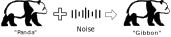
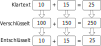

Im Folgenden wird eine Auswahl an Schutzmaßnahmen vorgestellt, die die **Privatsphäre** oder **Integrität** von Machine
Learning (ML) Modellen (z.B. *neuronalen Netzen*) erhöhen sollen.

Weil die Schutzmaßnahmen im Training angewandt werden, wird hier zuerst das Training neuronaler Netze im Allgemeinen
beschrieben. Im Training lernt ein neuronales Netz mithilfe von Trainingsdaten, die Datenpunkte einer
Zieldatenverteilung zu klassifizieren, indem dessen Parameter in einem iterativen Prozess verändert werden. Dabei
klassifiziert das neuronale Netz die Trainingsdaten und die Klassifikationen werden durch das Netz zurück
propagiert, wobei die Parameter in Richtung der korrekten Klassifikation angepasst werden. Diese Anpassung der
Modellparameter wird *Gradientenabstieg* genannt. Wenn das Modell die Qualität seiner Klassifikationen nicht mehr
verbessern kann, wird das Training beendet.

 

## Adversarial Retraining
 

 
 

Adversarial Retraining ist eine Abwehrtechnik gegen sogenannte Adversarial Examples (AE). AEs sind manipulierte Inputs
für neuronale Netze, welche zu einer fehlerhaften Vorhersage führen sollen. Dabei ist die Manipulation so subtil, dass
sie für den menschlichen Betrachter nicht erkennbar ist. Beim Adversarial Retraining werden solche AEs mit in das
Training des zu schützenden Modells aufgenommen, um dessen Robustheit und damit seine Integrität zu erhöhen.

> Ein besonders beeindruckendes Beispiel von Adversarial Attacks ist die *One-Pixel-Attack*. Dabei wird nur ein Pixel in
Bildern verändert. Häufig reicht diese kleine Veränderung aus, damit ein neuronales Netz das Bild falsch klassifiziert.

 

<strong>Funktionsweise</strong>

Ein AE kann erzeugt werden, indem ein echter Datenpunkt von dem Zielmodell oder einem ähnlichen klassifiziert wird. Dann
wird die Vorhersage durch das Netz bis in den Input hinein zurück propagiert, sodass dieser verändert wird in Richtung
der gewünschten falschen Vorhersage. Dadurch wird der Input genau so verändert, dass das Modell ihn schon mit geringer
Veränderung falsch klassifiziert. Je nach Art der Adversarial Attack wird der Gradientenabstieg anders und ggf. auch
mehrfach durchgeführt. Im Adversarial Retraining werden mithilfe des zu trainierenden Modells AEs aus Trainingsdaten
erzeugt und dem Modell als Trainingsdaten gegeben.

 

<strong>Verwendung</strong>

Bei linearen Modellen wie zum Beispiel Support Vector Machines oder linearer Regression kann Adversarial Retraining
nicht angewandt werden. Neuronale Netze hingegen werden unter Anwendung von Adversarial Retraining tatsächlich robuster
gegenüber AEs.

 

## Differential Privacy
 

 
 

Differential Privacy (DP) ist eine populäre Metrik, mit welcher der Einfluss einzelner Daten auf das Ergebnis einer
Datenverarbeitung bemessen wird. Dies entspricht gleichzeitig dem Privatsphäreverlust der Personen, zu denen die Daten
gehören. Der Privatsphäreverlust wird durch das Hinzufügen von Rauschen in der Datenverarbeitung begrenzt. Ursprünglich
kommt DP aus dem Bereich Datenbanken, wird aber seit einigen Jahren auch für *privatsphäre-bewahrendes ML* benutzt.

> Der Netflix Prize war ein im Jahr 2006 vom Streaming-Dienst Netflix ausgeschriebener Wettbewerb. Ziel war es, den
besten Vorhersage-Algorithmus zu finden, welcher das Bewertungsverhalten einzelner Nutzer vorhersagen sollte. Netflix
stellte Daten von über 500.000 Nutzern bereit, mit deren Hilfe die Programmierer ihre Algorithmen trainieren
konnten. Zwei Wissenschaftler der University of Texas kamen auf die Idee einer sogenannten Linkage Attack. Hierfür
wurden die Trainingsdatensätze von Netflix mit den Bewertungen einer anderen Bewertungsplattform namens IMDb
abgeglichen. Dadurch konnten tatsächlich einige Nutzer aus den Netflix-Datensätzen identifiziert werden und es gelang
eine partielle De-Anonymisierung der Daten.

 

<strong>Funktionsweise</strong>

Im ML kann die Privatsphäre von Personen geschützt werden, indem Informationen über deren Daten nur verrauscht in ein
neuronales Netz einfließen. Dabei wird der Gradient jedes einzelnen Datenpunkts so gestutzt, dass seine Norm einen
gewissen Grenzwert nicht übersteigt und zusätzlich wird der Gradient verrauscht. Mit dieser Technik wird der
Privatsphäreverlust nicht nur reduziert, sondern kann auch quantifiziert werden.

 

## Homomorphic Encryption
 

 
 

Homomorphic Encryption (HE) ermöglicht Rechenoperationen wie Addition oder Multiplikation auf verschlüsselten Daten. Die
Ergebnisse liegen in verschlüsselter Form vor und sind nur mit Kenntnis des passenden Schlüssels einsehbar. Die
Berechnungen liefern dabei die gleichen Ergebnisse, als wären sie auf unverschlüsselten Daten erfolgt.

> Forscher arbeiten an praktischen Anwendungen der HE, wie z.B. der Verbesserung der Sicherheit und Transparenz von
Wahlen. So könnten mithilfe des Paillier-Kryptosystems verschlüsselte Wahlstimmen automatisch - und damit korrekt -
ausgezählt werden, ohne die echten Stimmen zu offenbaren. Dadurch könnte die Unverfälschtheit einer Wahl und
gleichzeitig die Privatsphäre der Wähler gewährleistet werden.

 

<strong>Verwendung</strong>

HE könnte in ML benutzt werden, um die Privatsphäre sowohl von den Trainingsdaten als auch von Nutzern zu schützen,
indem sie ML-Modelle ermöglicht, die verschlüsselte Daten als Input annehmen können und verschlüsselte Vorhersagen
ausgeben. Leider wurde bisher noch keine solche Methode für neuronale Netze entwickelt.

 

## Anomaly Detection
 

 
 

Als Anomaly Detection wird die Erkennung von Besonderheiten in Daten genannt. Durch Anwendung von Anomaly Detection
können kritische Inputs wie AEs gefiltert werden, sodass die Robustheit und damit die Integrität von ML-Modellen erhöht
wird.

> Anomalieerkennung findet in vielen Bereichen, wie zum Beispiel der Text- und Bildverarbeitung, Betrugserkennung oder
in der Medizin Anwendung.

 

<strong>Verwendung</strong>

Um die Robustheit von neuronalen Netzen zu erhöhen, muss ein weiteres Netz parallel dazu genutzt werden, um kritische
Inputs zu erkennen und zu entfernen. Dies erfordert zusätzliche Rechenressourcen. Alternativ zum Schutz der Robustheit
von ML-Modellen kann Anomaly Detection auch für den Schutz der Privatsphäre von Trainingsdaten in ML benutzt werden. So
können mittels Membership Inference Attacks bzgl. Privatsphäre besonders gefährdete Trainingsdaten erkannt und aus dem
Training ausgeschlossen werden.

 

## Evaluation
Um die Schutzmaßnahmen vergleichen und deren Tauglichkeit für die Anwendung auf leistungsschwächeren Geräten wie
eingebettete und Mobilgeräte bewerten zu können, wurden verschiedene ML-Experimente durchgeführt. Dabei wurden neuronale
Netze auf dem MNIST- oder dem CIFAR-10-Datensatz mit je einer oder ohne Schutzmaßnahme trainiert. Der MNIST-Datensatz
enthält 70.000 graustufige Bilder von handgeschriebenen Ziffern. Der CIFAR-10-Datensatz enthält 60.000 farbige Bilder
von verschiedenen Tieren oder Fahrzeugen. Für den MNIST-Datensatz wurde ein Multi-Layer-Perceptron (MLP) mit etwa
670.000 Parametern verwendet, während für den CIFAR-10-Datensatz ein Convolutional-Neural-Network (CNN) mit ca. 5,8 Mio.
Parametern gewählt wurde. Die Modelle wurden jeweils in 50 Epochen trainiert und anschließend für die Inferenz von
10.000 Daten benutzt. Für die Inferenz wurde immer die akkurateste Version des Modells über alle Trainingsepochen
verwendet und alle 10.000 Inferenzdaten wurden einzeln klassifiziert.

 

<!-- Header -->

<h3 style="text-align:center">
Vergleich der Vorhersagequalität
</h3>

<text><i>
Die Grafik zeigt den Verlauf der Accuracy (Vorhersagequalität) der ML-Modelle mit verschiedenen Schutzmechanismen für
beide Datensätze. Auf beiden Datensätzen ist die Accuracy von Modellen, die mit Differential Privacy geschützt wurden,
am schlechtesten. ML-Modelle ohne Schutzmechanismus haben über den gesamten Trainingsverlauf eine sehr ähnliche hohe
Accuracy auf beiden Datensätzen. Das Adversarial Training und Retraining beeinflusst die Accuracy auf dem
MNIST-Datensatz positiv, während beide auf dem CIFAR-10-Datensatz zu einer verschlechterten Accuracy führen.
</i></text>
 
 
 
 
 

<h3 style="text-align:center">
Vergleich der Trainingszeit
</h3>

<text><i>
Eingebettete und Mobilgeräte haben weniger Rechenressourcen als Desktop-PCs, Rack-Server oder Rechen-Cluster. Daher
wird das Training von neuronalen Netzen meist auf letzteren durchgeführt. Dennoch ist das Training auf manchen
eingebetteten Geräten wie den Jetson-Ge-räten von Nvidia möglich. Die folgende Grafik veranschaulicht die Trainingszeit
von ML-Experimenten mit verschiedenen Schutzmechanismen auf zwei verschiedenen Jetson-Geräten sowie einem Desktop-PC.
Die Trainingszeit ist in Sekunden auf logarithmischer Skala dargestellt. Trainings ohne Schutzmechanismus und mit
Anomaly Detection benötigen etwa gleich viel Zeit, während Differential Privacy eine deutliche Verlangsamung verursacht.
Adversarial Training und Retraining benötigen wiederum ein Vielfaches der Trainingszeit von Differential Privacy. Ein
klarer Unterschied ist auch zwischen den verschiedenen Geräten zu erkennen. Das Jetson Nano ist wesentlich langsamer als
das Jetson Xavier NX, welches seinerseits deutlich langsamer ist als der PC. Da viele Code-Bibliotheken nur sehr
umständlich auf den Jetson-Geräten installiert werden können, wurden die Schutzmaßnahmen Anomaly Detection und
Adversarial Training bzw. Retraining nicht angewandt.
</i></text>

<h3 style="text-align:center">
Vergleich der Inferenzzeit
</h3>

<text><i>
Die fertig trainierten ML-Modelle wurden auf verschiedenen Geräten ausgeführt, um einzeln alle 10.000 Testdaten eines
der beiden Daten-sätze zu klassifizieren. Die durchschnittliche Inferenzzeit pro Datenpunkt ist in der folgenden Grafik
für jedes Experiment in Mikrosekunden dargestellt. Für den einfacheren MNIST-Datensatz ist eine klare Ordnung von
Inferenzzeiten zwischen den Geräten PC, Jetson Xavier NX, Jetson Nano, Coral Dev Board Mini und Neural Compute Stick 2
(NCS2) zu erkennen, während die Schutzmechanismen keinerlei Einfluss haben. Für den komplexeren CIFAR-10-Datensatz ist
der NCS2 schneller als das Jetson Nano. Außerdem ist die Inferenzzeit für alle Schutzmechanismen auf dem gleichen Gerät
etwa identisch bis auf Differential Privacy. Dies liegt an einer Modell-Schicht im CNN, die für die Anwendbarkeit von
Differential Privacy von einer ähnlichen Schicht ersetzt wurde. Leider konnten keine Experimente auf dem
CIFAR-10-Datensatz auf dem Coral Dev Board Mini durchgeführt werden, weil das CNN nicht für dessen Inferenz-Chip namens
Edge-TPU kompiliert werden konnte.
</i></text>
 
 

<a class="prev" onclick="plusSlides(-1)">&#10094;</a>
<a class="next" onclick="plusSlides(1)">&#10095;</a>

  
  
  

<!-- Javascript -->

## Literaturempfehlungen

Goodfellow, I. J., Shlens, J., and Szegedy, C. "Explaining and Harnessing Adversarial Examples" in ICLR (2015).

Abadi, M., Chu, A., Goodfellow, I. J., McMahan, H. B., Mironov, I., Talwar, K., and Zhang, L. "Deep Learning with
Differential Privacy" in ACM CCS (2016).

Acar, A., Aksu, H., Uluagac, A. S., and Conti, M. "A Survey on Homomorphic Encryption Schemes: Theory and
Implementation" in ACM CSUR (2018).

Chandola, V., Banerjee, A., and Kumar, V. "Anomaly Detection: A Survey" in ACM CSUR (2009).
