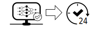
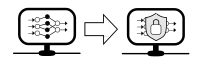

Ein wichtiger Schritt, um die Sicherheit von Systemen, die Künstliche Intelligenz (KI)-Anwendungen verwenden, zu evaluieren, ist es, konkrete Schutzziele für die KI zu definieren. Anhand dieser können die Anwendungen dann bewertet und ihr Schutzbedarf bestimmt werden.
In Anlehnung an die klassischen Schutzziele aus der IT-Sicherheit, wurden folgende vier Schutzziele herausgearbeitet und auf KI übertragen. 

<strong>Details zum Angriffsvektor gegen KI-Anwendungen</strong>

Der Angriffsvektor gegen KI-Anwendungen lässt sich am besten über das Wissen und die Fähigkeiten der Angreifer beschreiben. 

### Angreifer Wissen
Je nachdem, ob ein Angreifer vollen, teilweise, oder keinen Zugriff auf die Interna der KI Anwendungen hat, spricht man von *Blackbox, Greybox und Whitebox*-Szenarien.
Angreifer können dabei über Wissen und Zugriff auf folgende Aspekte verfügen:

 1. Trainingsdaten der KI-Anwendung
 2. Trainingsalgorithmus
 3. Trainiertes Modell der KI-Anwendung und dessen Parameter

Ein Angreifer, der auf alle drei Aspekte vollen Zugriff hat, wird als Angreifer mit "perfektem Wissen" bezeichnet. Solche Angreifer zu betrachten erlaubt es, **worst case**-Abschätzungen für die Sicherheit der KI-Systeme durchzuführen.

Jedoch sind derartige Angreifer in der Praxis nicht komplett realistisch. Realistischer sind stattdessen Angreifer mit "begrenztem Wissen".

### Angreifer Fähigkeiten
Die Fähigkeiten eines Angreifers können anhand des Einflusses, welche er auf das trainierte Modell der KI-Anwendung und dessen Trainingsdaten hat folgende sein:
| Trainingsdaten | KI-Modell |
|--|--|
| - Hinzufügen oder Löschen beliebiger Datenpunkten und beliebigen Labels dazu|- Unbegrenzte Anzahl an Interaktionen nach dem Training  |
|- Hinzufügen oder Löschen von bestimmten Datenpunkten aber  ohne Einfluss auf die Labels|-  Begrenzte Anzahl an Interaktionen nach dem Training|
|- Modifizierung beliebiger oder bestimmter Datenpunkte |- Manipulation des Trainingsprozesses|
|- Modifizierung von Labels zu bestimmten Datenpunkten|- Beeinflussung folgender Trainingsschritte und zukünftiger Anpassungen|

&nbsp;

## Integrität

Integrität von KI-Modellen bedeutet, dass die Modelle "richtige" Vorhersagen auf verschiedensten eintreffenden Daten machen. 

> Als Beispiel kann man sich einen Spamfilter vorstellen, der auf sinnvollen Daten trainiert wurde. Dieser sollte auch noch korrekt funktionieren, d.h. Spam erkennen, auch wenn ein Angreifer eine Spam Email gezielt so verfasst, dass sie viele Elemente einer Nicht-Spam Email beinhaltet.

<strong>Details</strong>

Integrität kann in KI-Anwendungen auf drei verschiedenen Ebenen beeinträchtigt werden:

 1. Datenebene: Gezielte Korruption der Daten, die das Modell vorhersagen soll.
 2. Modellebene: Gezielte Manipulation des Modellverhaltens oder der Modellparameter.
 3. Output/Objektebene: Gezielte Manipulation der Reaktionen des KI-Systems auf spezifische Modellvorhersagen.

#### Dateneben
Auf der Datenebene können Inputs des Modells gezielt beeinflusst werden, um zu falschen Vorhersagen zu führen.

#### Modellebene
Auf der Modellebene können Parameter des Modells während oder nach dem Training so beeinflusst werden, dass das Modell falsche Vorhersagen macht.

#### Objektebene
Auf der Objektebene können Modelloutputs so manipuliert werden, dass das darumliegende System, welches auf der KI basiert falsch auf den zugehörigen Input reagiert.

Im Kontext der Integrität stehen außerdem die **Verlässlichkeit** und **Beherrschbarkeit**. Im Falle der Verlässlichkeit kann ein Angreifer unzulässige Systemzustände bspw. durch unsinnige Eingaben erreichen. Dahingegen ist die  Beherrschbarkeit angegriffen, wenn ein Angreifer dem das System auf der Modellebene zu einen nicht-intendierten Verhalten bringen kann.

&nbsp;

## Verfügbarkeit

Bei der Verfügbarkeit in KI-Modellen geht es darum sicherzustellen, dass das Modell die Funktionalität erfüllt, für die es eingesetzt wird.

> Nehmen wir als Beispiel nochmal den Spamfilter. Bei der Verfügbarkeit des Modells geht es weniger darum Spam zu verweigern (siehe Integrität), sondern darum sicherzustellen, dass Nicht-Spam Nachrichten durchkommen und die Nutzerin damit ihr Emailpostfach sinnvoll nutzen kann.

<strong>Details</strong>

Wenn ein Angreifer auf die Verfügbarkeit des Modells abzielt, veranlasst er das System  dazu, gutartige Instanzen zu verweigern und dadurch nicht richtig zu arbeiten.

Wenn die  Ausgabe des ML-Modells in die Funktion des Systems eingebunden ist, kann dies als Denial-of-Service-Angriff betrachtet werden.

&nbsp;

## Vertraulichkeit

Vertraulichkeit beschreibt den Zustand, dass interne Eigenschaften und vertrauliche Informationen über ein trainiertes Modell den Angreifern verborgen bleiben.

> Beim Spamfilter sollte es also Angreifern nicht möglich sein, herauszufinden, welche Zeichen, Wörter, oder Formatierungen dieser besonders als Indikatoren für Spam nutzt.

<strong>Details</strong>

Ein Angriff auf die Vertraulichkeit kann es einem Angreifer ermöglichen, an  sensible und vertrauliche Informationen über das trainierte ML-Modell, seine Eigenschaften,  Struktur und Parameter zu kommen. Dadurch könnte der Angreifer in der Lage sein, das im Modell repräsentierte geistige Eigentum zu stehlen, gezielter zu manipulieren, oder auch basierend auf dem gewonnen Wissen die Privatheit der Trainingsdaten anzugreifen.

&nbsp;

## Privatheit

Privatheit bezieht sich im KI-Anwendungsbereich auf die Privatheit der Trainingsdaten, auf denen KI-Modelle trainiert werden. Die Modelle sollten im besten Fall keine privaten Informationen über diese preisgeben.

> Bei einem Spamfilter, der auf privaten Emails von Alice and Bob trainiert wurde, sollen also weder sein späteres Verhalten noch seine Eigenschaften Rückschlüsse darauf zulassen, was Alice an Bob geschrieben hat.

<strong>Details</strong>

Bei einem Angriff auf die Privatheit des Modells kann ein Angreifer Informationen über die - möglicherweise sensiblen - Trainingsdaten erlangen. Dies kann schwerwiegende Auswirkungen auf die Privatsphäre der betroffenen Dateninhaber*innen haben.

Ein wichtiger Aspekt im Bereich der Privatheit ist die **Anonymität** in Abgrenzung zur  **Pseudonymität**. Anonymität kann als der Schutz vor Identifizierung im Allgemeinen,  und Pseudonymität als der Schutz vor namentlicher Identifizierung definiert werde. Dies impliziert, dass  bspw. zum Erreichen der Anonymität  zwei Bilder nicht einander zugeordnet werden dürfen. Speziell während des Trainings von KI-gestützter Identifikation im Bereich der Biometrie kann an Anonymität nicht gewährleistet werden. Hier ist es das schwächere Schutzziel der Pseudonymität zu verfolgen.

&nbsp;

# Zuordnung von Schutzzielen und Konkreten Attacken gegen KI-Modelle
Es existieren Attacken gegen KI-Anwendungen und Modelle, welche gezielt die folgenden Schutzziele angreifen.

|Schutzziel|Attacken |
|--|--|
|Integrität| Adversarial Attacken |
|Verfügbarkeit| Data Poisoning|
|Vertraulichkeit| Model Stealing und Model Extraction|
|Privatheit| Model Inversion, Membership Inference, Attribute Inference, Property Inference|

<strong>Details zu den Attacken</strong>

### Adversarial Attacken
Bei Adversarial Attacken manipuliert ein Angreifer einen Datenpunkt, den das fertig trainierte KI-Modell voraussagen soll so, dass die Voraussage des Modells falsch sein wird.
Das kann z.B. die gezielte Veränderung von Pixeln in einem Bild sein, sodass das eigentliche Objekt im Bild nicht mehr richtig erkannt wird.

### Data Poisoning
Im Data Poisoning geht es darum, dass ein Angreifer schon während des Modelltrainings die Trainingsdaten gezielt manipulieren kann. Dadurch wird die Voraussagequalität der Modells gezielt manipuliert.
Z.B. kann ein Angreifer dies nutzen, um einen Spam-Filter zu umgehen. Wenn das Modell darauf trainiert wurde, gezielt gewählte Worte mit Non-Spam-Nachrichten zu assoziieren, kann ein Angreifer Spam später nicht erkannt werden lassen, indem er diese Worte benutzt.

### Model Stealing, Model Extraction
Bei Model Stealing geht es darum, ein trainiertes Modell von seinen eigentlichen Besitzern zu entwenden, z.B. indem es kopiert wird.

Model Extraction ist eine spezielle Form des Model Stealings, in dem ein Modell über Blackbox-Zugang gestohlen wird. Das heißt, dass ein Angreifer mit dem Modell nur über eine Schnittstelle interagieren kann, aber die erhaltenen Voraussagen des Modells schon gut genug ist, um ein Ersatzmodell zu trainieren, welches das Verhalten des zu stehlenden aufweist.

### Model Inversion
Bei Model Inversion geht es darum, aus einem trainierten KI-Modell Informationen über die Trainingsdaten zu erhalten. Genauer gesagt kann in der Model Inversion eine durchschnittliche Repräsentation der Trainingsdaten (einer bestimmten Klasse) wieder hergestellt werden.

### Membership Inference
Membership Inference Attacken beschäftigen sich mit der Frage, ob ein bestimmter Datenpunkt für das Training des Modells benutzt wurde. Dies kann zu Problemen mit der Privatsphäre dieses Datenpunktes führen. Stellt man sich vor, man nutzt einen Klassifikator, der Krebspatientinnen Behandlungsmethoden vorschlägt, so kann man sicher sein, dass dieser Klassifikator auf den Daten von Krebspatientinnen trainiert wurde. Die Information, dass ein konkreter Datenpunkt für das Training verwendet wurde, ist also äquivalent zu der Information, dass das zugehörige Individuum Krebs hat.

### Attribute Inference
Bei Attribute Inference geht es darum, anhand öffentlich bekannter Merkmale zu einem Datenpunkt und Zugriff auf ein Modell, welches mit diesem Datenpunkt (und seinen sensiblen und privaten Merkmalen) trainiert wurde, die sensiblen Merkmale zu erfahren.

### Property Inference
Bei Property Inference geht es darum, Eigenschaften über das gesamte Trainingsset eines KI-Modells zu erhalten, wie zum Beispiel die Verteilung der Daten. Solche Informationen können zu Privatsphäreproblemen, insbesondere für Minderheiten in der Verteilung führen.

&nbsp;

## Literaturempfehlungen
Dario Amodei, Chris Olah, Jacob Steinhardt, Paul Christiano, John Schulman,
and Dan Mané. Concrete Problems in AI Safety. 2016. url: https://arxiv.org/pdf/1606.06565.

Marco Barreno, Blaine Nelson, Anthony D. Joseph, and J. D. Tygar. “The
security of machine learning”. In: Machine Learning 81.2 (2010), pp. 121–148.
issn: 1573-0565. doi: 10.1007/s10994-010-5188-5. url: https://link.springer.com/content/pdf/10.1007/s10994-010-5188-5.pdf.

Mark Bedner and Tobias Ackermann, “Schutzziele der IT-Sicherheit,” Datenschutz und Datensicherheit - DuD 34, no. 5 (May 2010): 323–28, doi: 10.1007/s11623-010-0096-1.

Luis Muñoz-González, Battista Biggio, Ambra Demontis, Andrea Paudice,
Vasin Wongrassamee, Emil C. Lupu, and Fabio Roli. “Towards Poisoning of
Deep Learning Algorithms with Back-gradient Optimization”. In: Proceedings
of the 10th ACM Workshop on Artificial Intelligence and Security - AISec ’17.
 pp. 27–38. isbn: 9781450352024. doi: 10.1145/3128572.3140451.

Nicolas Papernot. A Marauder’s Map of Security and Privacy in Machine Learning.url: http://arxiv.org/pdf/1811.01134v1. 2016

Nicolas Papernot, Patrick McDaniel, Ian Goodfellow, Somesh Jha, Z. Berkay
Celik, and Ananthram Swami. “Practical Black-Box Attacks against Machine
Learning”. In: Proceedings of the 2017 ACM on Asia Conference on Computerand Communications Security. Ed. by Ramesh Karri. ACM, 2017. isbn: 9781450349444. doi: 10.1145/3052973.3053009.

Nicolas Papernot, Patrick McDaniel, Arunesh Sinha, and Michael P.Wellman.
“SoK: Security and Privacy in Machine Learning”. In: 3rd IEEE European
Symposium on Security and Privacy. Los Alamitos, California: Conference
Publishing Services, IEEE Computer Society, 2018. isbn: 9781538642283. doi: 10.1109/eurosp.2018.00035.

