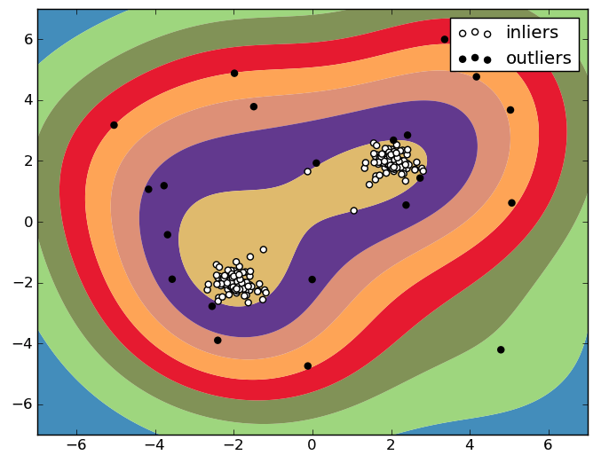
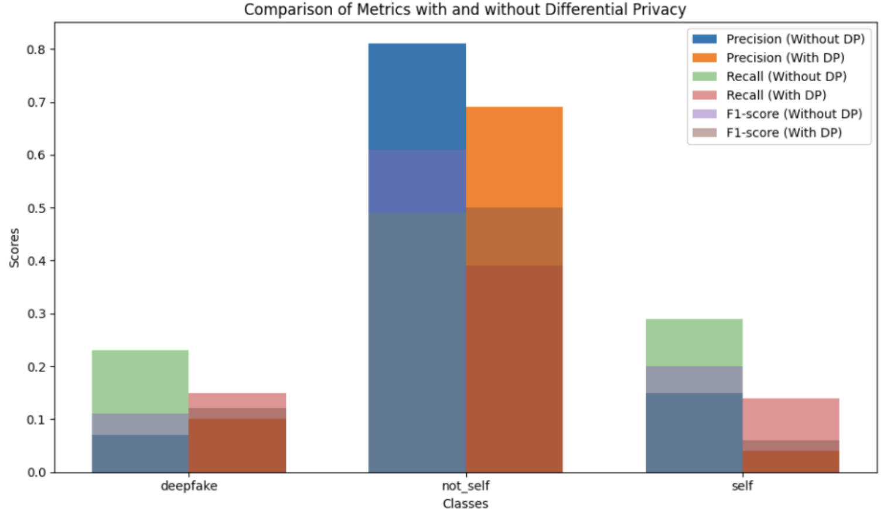
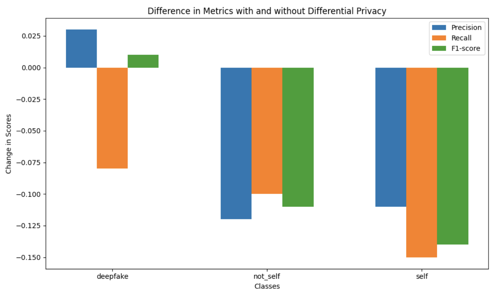
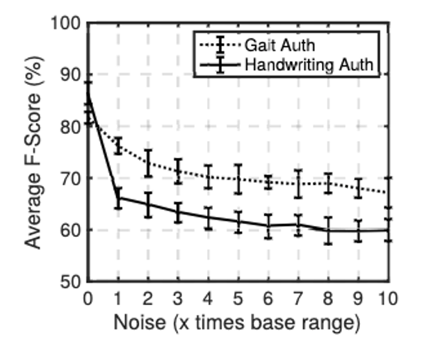

## Description of Security Goals 
This chapter briefly describes the security goals mentioned in this document.
### Robustness
The robustness of an AI-Model consists of two factors: The integrity and the availability of the model. **Integrity** of AI models means the models make the right predictions for a variety of data. This can be impaired by influencing the model-inputs, -outputs and/or parameters. The **availability** in AI models ensures that the model fulfills the functionality it is used for.
If an attackers is targeting the availability of a model he makes the system decline harmless instances in which case the system can't work properly anymore. If the output of an AI model is integrated into the function of the system this can be seen as a denial-of-service attack.
### Privacy
Privacy in AI applications means the protecting the privacy of training data used to train the AI model. The models should withhold all private information. In case of an attack on a model’s privacy the attacker may gain information regarding the - maybe sensitive - training data. This can lead to serious consequences for the privacy of the involved parties. An important aspect of privacy is **anonymity** and its disctinction to **pseudonymity**. Anonymity can be defined as protections against general identification and pseudonymity as protection against identification of the name. 
This implies, that in order to achieve anonymity two picutures should not be correlated with each other. Especially during Training of AI-based identification with biometrics, anonymity is unachiveable and pseudonymity is the main goal. However pseudonymity could be circumvented by correlating multiple databases in so called "Linkage Attacks".
### Confidentiality
Confidentiality describes a state in which the internal properties and confidential information on the trained model remain hidden from a potential attacker. 
An attack on the confidentiality may allow an attacker to gather sensitive and confidential information regarding the trained AI model, its properties, structure and parameters. With this information, the attacker could be able to steal the intellectual properties, manipulate or attack the privacy of the training data.
 
## Prototypes
Two prototypes were developed during the projects runtime. The application **SeamlessMe** authenticates a person based on their gait pattern. **Self-ID** verifies the identity of a user during a video call by analysing eyetracker-data in response to their displayed image.
The security requirements of these prototypes were identified and based on the requirements project related security measures were recommended. Recommendations were implemented and evaluated.

### Gait-Authentication (SeamlessMe) 
The machine learning algorithm used in the "SeamlessMe" demonstrator is a one-class classification, which is enhanced by an outlier detection method (novelty detection). A generic classifier is loaded onto the mobile device. The model then learns locally based on the user data collected on the device (User Specific Classifier). The trained model is then used to generate a trust level (confidence value). The user's trust level is calculated locally on the smartphone and without communication with an external server. Both the training and the inference therefore take place directly on the end device.

### Self identification (Self-ID) 
In the application of the demonstrator "Self-ID", a binary classifier (self-image vs. external image) is trained on a population. Using eye-tracking data, this classifier learns to distinguish which class of facial images the user is currently seeing. The training process takes place in advance - offline - and on the basis of previously collected training data. If personal enrollment is necessary, it takes place on the end device and the trained model is then transferred to the server. The inference runs online on the server. The eye-tracking data is transferred from the client to the server which evaluates the result and initiates appropriate measures if necessary.

## Security Measures
### Adversarial Training 
Adversarial retraining is a protective measure to strengthen the robustness of a machine learning model and a defense technique against so-called Adversarial Examples (AE). AEs are manipulated inputs for neural networks that are intended to lead to an incorrect prediction. The manipulation is so subtle that it is barely recognizable to the human observer. In adversarial retraining, such AEs are included in the training data of the model in order to increase its integrity.

#### Scenario
The proposed security measure was tested using the **Self-ID** demonstrator. 

In the selected attack scenario, subtle changes to the input data of the model led to incorrect outputs. This reduced the reliability and confidence of the machine learning system. Neural networks were not used. 

In the chosen scenario the targeted manipulation of input data was carried out by an "internal attacker" . More complex evasion attacks, such as the generation of AEs by Generative Adversarial Networks (GANs), were not used. For the example attack, a sufficiently strong bias had to be found first so that a false prediction would result. 

The designed attack scenario had various prerequisites: 
**Access to the input data**

In the chosen example, the type and exact structure of the input data were known, thus relatively small changes of the data were sufficient to manipulate the outcome.  

**Insight into the predictions**

For the example, the degree of change in the input data at which a different label was predicted was recorded. Within the test environment, it was thus possible to trace when the values exceeded a threshold value.  

**Arbitrary number of predictions**

The number of predictions made in the test environment was unlimited.

#### Experiences
In the selected example, an "internal" attacker who had access to the entire project and the results of the classification was simulated . Without knowledge of the effects of the AEs, these would not have changed the prediction result in a foreseeable way. Furthermore, knowledge of the used features is required, which is not necessarily available to the attacker. 

Experience has shown that a change without sufficient knowledge cannot lead to the desired result. Depending on the system architecture, the attacker may not be able to understand whether his AEs have actually triggered a change in the prediction.

#### Implementation help  

Eine Vielzahl an Beispielen und Implementierungsmöglichkeit finden sich in folgender Bibliothek:  Adversarial Robustness Toolbox[^6]

**Code-Snippets**
**"Tips & Tricks"**
A large number of examples and implementation options can be found in the following library: Adversarial Robustness Toolbox[^6]

**Code snippets**
Manipulate input data 
```python
    perturbation_sample = sample_array + perturbation_strength
```

View effects and compare predictions
```python
    original_prediction = classifier.predict(original_sample_df)
    perturbed_prediction = classifier.predict(perturbation_sample)
```

### Anomaly Detection 
Anomaly detection is used to strengthen the robustness of a machine learning system. By using anomaly detection, critical inputs (such as AEs) can be filtered to remove unusually deviant data inputs that could affect the integrity of the model.

#### Scenario
The proposed security measure was tested using the **SeamlessMe** demonstrator. The aim is to find the smallest possible boundary that surrounds the normal data points, while at the same time outliers lie outside this boundary. SeamlessMe already uses the anomaly detection procedure indirectly as an authentication algorithm:  

SeamlessMe recognizes gait sequences that do not match the previously trained samples. If this is the case, the person is not considered authenticated. Likewise, the data recorded at the time (non-authenticated) is not used to train the model. Only if the algorithm is certain that the data matches the trained person the data is used for training. 

A One-Class Support Vector Machine was used to detect outliers. A one-class SVM is a machine learning algorithm that is able to recognize outliers in a data set. 
In the selected example, only one class of data is available. In the demonstrator, this class is the person carrying the cell phone. The deviating data or outliers are data that point to a different person and therefore belong to a different class.

The One-Class SVM constructs a decision boundary around the "normal" data points so that an area is delimited. All data points outside this area are considered outliers. An illustration of this distinction is shown below: 



*Figure 1: One-Class SVM [^1]*

Anomaly detection was proposed for **Self-ID**, but was not implemented because the effort required was too high for a research prototype. Data cleansing was sufficient for data acquisition and anomaly detection was not necessary. The measure should be reconsidered for the final product.

#### Implementation help   
**“Tips & Tricks”** 
Used SVM parameters:

- Kernel: Gaussian Radial Basis Function (RBF) 

- Kernel functions: "Polynomial" and "Sigmoid" not used

The gamma describes the kernel coefficient. The gamma parameter refers to $ \frac{1}{2*\sigma^2} $ in the following formula: $ K(x_i,x_j) = exp(-\frac{\| x_i - x_j \|^2}{2*\sigma^2}) $

**Code-Snippet** 
(Python: Initialization One-Class-SVM) 
```python
    from sklearn.svm import OneClassSVM

    OneClassSVM.__init__(self, kernel='rbf', degree=3, gamma='scale')
```

### Data-Sanitization 
Data sanitization of input data is a measure to improve robustness by e.g, cleansing or removing incomplete data in order to bring all data into the appropriate form.   

Data sanitization of output data, on the other hand, mitigates privacy attacks. Sensitive output data is filtered before it is emitted. Data is considered sensitive if it allows conclusions about the model's training data. An example of this in the case of classification would be the confidence values per class. These values can be used by attackers to carry out stronger privacy attacks. Instead of giving the attacker access to every value, only the class with the highest confidence value is emitted.

#### Scenario
Unusable or incorrect data is filtered. For the **Self-ID** demonstrator, incorrect images or images containing a blink are therefore removed. The filtering also includes the removal of unnecessary data from the eye tracker data. The data is normalized and scaled. Part of the output data are the confidence values. These values are only shown in the prototype phase in the video client. In the finished product, the strength of confidence in the video client should be represented in a more generic way for the video call participant in question.	 

With **SeamlessMe**, activity recognition of the authentication model is performed upstream. Only data that corresponds to the walking pattern of a person is used for gait authentication. This means that data sanitization of the input data is already carried out.

#### Experiences
**Data Sanitization of Input-Data**  

One experience that has been made involves approximating the correct threshold value for filtering. It should be noted that no training data is removed that still holds enough significance, eventhough a smaller part is invalid. 	 
To enable comparability within the Self-ID demonstrator, a minimum number of data points is calculated before an image is presented and a minimum number of data points is calculated after the image is presented. Data points that fall outside this window are removed so that all trials are the same length. The minimum number of data points describes the shortest period of time that does not distort the image. The differences between the recordings result from the latency of the eye tracker.

**Data Sanitization of Output-Data** 		 

As described in the section "Scenario", a log of the model results is required to interpret the results of the model creation. Each run with different parameters was logged and stored. The log files describe the changes in the performance metrics caused by the change in input parameters. 
This logging included the confidence values of all classes. An overview of these values was necessary for the optimization of the models. These values are no longer supplied for the final application, so that no conclusions can be drawn about the model's training data.  Feedback between the user and the application is useful if a confidence level is to be returned. An example of this is that the recognition of classes should be marked within the demonstrators.

#### Implementation help
**“Tips & Tricks”** 

The research project worked with time series. One type of data cleansing is the normalization of data. In this subject area, the source Normalization and Bias in Time Series Data[^2] by Aishwarya Asesh has proven to be helpful

**Code-Snippet** 
```python
    def normalize(x):
        minimum = np.min(x)
        maximum = np.max(x)
        y = (x - minimum) / (maximum - minimum)

        return np.array(y)
```

### Differential Privacy
Differential privacy (DP) is a popular metric used to measure the impact of individual data on the outcome of data processing. This also corresponds to the privacy loss of the individuals to whom the data belongs. The loss of privacy is limited by the addition of noise in the data processing. DP originally comes from the field of databases, but has also been used for privacy-preserving ML for several years.

#### Scenario
Differential Privacy was tested within the **Self-ID** demonstrator to determine the impact of noise on prediction quality.  

A publicly available library was used to examine the effects of differential privacy (DP): Diffprivlib[^3] is a general library for experimenting, investigating and developing applications in the field of differential privacy.

#### Experiences
The influence of differential privacy led to a reduction in the values of the metrics for all classes considered. Precision, Recall and F1-Score decreased for all classes. The use of differential privacy can be compared to the addition of noise, so a trade-off must be made between prediction quality and protection. Too much noise can affect the accuracy of predictions, while too little noise jeopardizes privacy.




*Figure 2: Differences in metrics*

The noise of input data is viewed critically. Reference is made to the paper 
*"Jekyll and Hyde: On The Double-Faced Nature of Smart-Phone Sensor Noise Injection "*. It observes the introduction of noise into smartphone sensor data used for gait authentication. 

The influence of "noise injection on the average F-scores obtained for gait-based authentication" can be seen in the following graph from the paper:



*Figure 3: Influence of Differential Privacy*

It can be shown how the F-score decreases significantly when more noise is added. High accuracy is important for the functionality of SeamlessMe so that a person can be recognized with a high probability.

#### Implementation help
**“Tips & Tricks”** 
The use of matplot is recommended to illustrate the results, as shown in the diagrams above.
 
**Code-Snippet** 
Example use of the Differential Privacy Library

```python
    from diffprivlib.models import GaussianNB

    clf = GaussianNB()
    clf.fit(X_train, y_train)

    clf.predict(X_test)
```

### Device attestation 
In device attestation, the integrity of a device (e.g. a smartphone) is confirmed by a cryptographic signature of a trusted component - e.g. Trusted Execution Environment (TEE), Secure Element (SE). The technical mechanisms used for this differ depending on the implementation, but the general aim is to confirm that the device is in a certain state that is not considered compromised. Device attestatioinferencee of a trusted component is also used for data attestation. This time, however, the signature is calculated using a specific date and attests that it has certain properties (e.g. that the data originates from a specific hardware). This form of attestation is also used to strengthen robustness. 

This protective measure was not implemented in the demonstrators of the SENSIBLE-KI joint project, as no data is collected from external sensor nodes or mobile devices that could be attested, and the measure can also only be implemented by specific hardware that could not be used sensibly for the development of the demonstrators. However, the evaluations of the measure as part of AP2 showed an increased latency in data collection, which could make the measure impractical depending on the type of data collection of the ML application.

### Model-Signatur 
When updating models via the network, the model should be signed to ensure that the receiver has received the correct model. The signature is created by the sender and checked on the end device before execution. For critical applications in particular, it makes sense to perform the attestation and signature using a trustworthy component. This measure strengthens the robustness of the ML system. 

This measure was not implemented in the demonstrators of the SENSIBLE-KI joint project, as there are no plans to transfer model updates via the network for either of the two applications. The evaluations of the measure carried out earlier in the project revealed increased latency when starting the application, the length of which depended heavily on the hardware used for signature and verification. It should also be noted that implementing this measure in a TEE would require the implementation and execution of a separate trusted application, which is currently not easily possible on standard mobile devices, for example.

### Encryption of Output Data 
One measure to improve privacy is to encrypt personalized output data before transmission or storage. It is advisable to use a trusted component for encryption, especially if the data is highly personal, as this offers better protection for the key material used.

#### Scenario 
The encryption was tested within the **SeamlessMe** demonstrator.
**Save key material** 

iOs: 

The key material is stored in the Secure Enclave. The Secure Enclave is a secure hardware component. This isolated area in the processor chip serves as security and protection for sensitive data. 

Android: 

The key material is stored in the hardware-backed keystore. The hardware-backed keystore is a physical hardware component that is responsible for the secure storage of cryptographic keys and sensitive data.	 
Not all devices support the cryptographic algorithms required to secure communication. This will result in additional work during implementation.

#### Experiences
**Correct choice of encryption algorithms:** 

The choice of a robust encryption algorithm such as AES or RSA depends on the desired level of security.  

**Key length and key management:** 

It is recommended to choose an appropriate key length, as a longer key length provides a higher level of security. The keys used should also be managed securely and only be accessible to authorized persons. Regular rotation of the keys is also recommended.  

**No loss of performance** 

The relatively small amount of data in the project did not lead to any loss of performance.

#### Implementation help
The documentation on the Android Keystore System[^4] and the iOS Secure Enclave[^5] is recommended for further research and for current examples.

### Inference in a TEE 
One way to achieve confidentiality, robustness and privacy at the same time is to execute an ML application within a Trusted Execution Environment as a so-called **Trusted Application**. In this way, the trained model would not come into contact with potentially malicious third-party applications and would be protected even if the operating system were compromised. Unfortunately, this measure cannot currently be implemented in practice without high technical hurdles and significant performance losses.  

Accordingly, the protective measure was not implemented in the demonstrators of the SENSIBLE-KI joint project.

[^1]: https://scikit-learn.sourceforge.net/0.6/auto_examples/svm/plot_oneclass.html
[^2]: https://link.springer.com/chapter/10.1007/978-3-031-11432-8_8 
[^3]: https://github.com/IBM/differential-privacy-library
[^4]: https://developer.android.com/privacy-and-security/keystore
[^5]: https://support.apple.com/de-de/guide/security/sec59b0b31ff/web
[^6]: https://adversarial-robustness-toolbox.readthedocs.io/en/latest/ 
