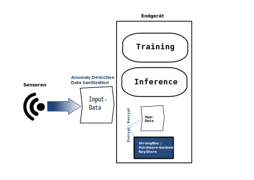
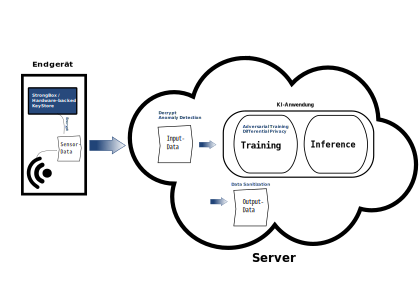

# Protective Measures for Prototypes and Application Scenarios

## 1. Introduction
In the following, software-based protective measures and procedures from the field of Trusted Computing are proposed to enhance protection against attacks on AI applications on mobile and embedded devices.

Chapter [2. Considered Measures](#2-considered-measures) provides an overview of all the measures considered in this document, along with their respective protective effects. Subsequently, in chapter [3. Protective Measures Based on Application Characteristics](#3-protective-measures-based-on-application-characteristics), these protective measures are initially suggested generically for applications with specific characteristics. Then, based on these generic suggestions, protective concepts for two concrete applications developed as part of the SENSIBLE-KI project, "SeamlessMe" and "Self-ID," are presented in Chapter [4. Reference Architectures](#4-reference-architectures).

The proposed measures and protective concepts should be considered **in addition to** general system and application security procedures (e.g., TLS encryption for network communication), which are not within the scope of this collaborative project.

## 2. Considered Measures
The measures considered here fall into either the realm of software-based protective measures or Trusted Computing procedures. In this section, all considered measures, along with their protective effects and other notable effects, are listed for reference.

### 2.1 Software-Based Measures
| Measure             | Protective Effect | Comment                                                           |
| ------------------- | ----------------- | ----------------------------------------------------------------- |
| adversarial training | robustness        | <ul><li>reduced accuracy</li><li>adverse impact on privacy</li></ul> |
| anomaly detection    | robustness        | <ul><li>increased latency and additional communication</li><li>additional hardware/devices or storage space required</li></ul> |
| data sanitization (input data) | robustness | |
| data sanitization (output data) | privacy | <ul><li>reduced accuracy and fairness</li></ul> |
| differential privacy | privacy | <ul><li>reduced accuracy and fairness</li><li>adverse impact on robustness</li></ul> |

### 2.2 Trusted Computing
| Procedure                        | Protective Effect | Comment                                           |
| -------------------------------- | ----------------- | ------------------------------------------------- |
| remote/device attestation         | robustness        | <ul><li>technical requirements on the device</li></ul> |
| data attestation (e.g., external sensor data) | robustness | <ul><li>high latency</li><li>requires specific setup with SE for input sensor data</li></ul> |
| model signature                   | robustness        | <ul><li>requires its own trusted application</li><li>increased latency at application startup</li></ul> |
| encryption of output data         | privacy           | <ul><li>additional latency compared to non-TC-based encryption</li></ul> |
| inference execution in TEE (trusted execution environment) | confidentiality, privacy, robustness | <ul><li>very high implementation hurdles</li><li>requires its own trusted application</li><li>significant performance impact depending on implementation</li><li>suitable only for embedded applications</li></ul> |

## 3. Protective Measures Based on Application Characteristics
In the following, application scenarios are differentiated into two abstract groups based on the architectural features of AI systems: **network-based applications** (such as P2P networks or the classical server-client architecture) and **end-node-only applications** – architectures limited to an end device. Network-based architectures require regular data exchange or, in the case of OTA updates, model updates over a network. In contrast, end-node-only architectures are restricted to an end device, and communication with another device is limited to information not related to the AI component of the application.

As these two architectural types mainly differ in the need for network-based exchange, general measures for AI applications with specific characteristics are recommended. For a specific application, the intersection of all proposed protective measures for that application can then be determined based on its characteristics.

**It should be noted that software-based protective measures for privacy and robustness tend to negatively influence each other.** This means that software-based privacy protection adversely affects robustness and vice versa. Therefore, it is necessary to assess on a case-by-case basis which protection goal is more important or whether adequate protection can be achieved solely through hardware-based measures. Furthermore, all **protective measures that require the execution of *custom code* within a Trusted Execution Environment (TEE) are currently not feasible for mobile applications.** This limitation arises from the fact that any applications to be executed in a TEE must be compiled together with its code. Therefore, as of today, only a few, mostly manufacturer-specific system apps can execute code within a user's mobile device TEE.

### 3.1 Measures Based on the Source of Input Data:
When using *trusted input data* to improve robustness and overall accuracy, Data Sanitization is recommended to clean or remove erroneous or incomplete data and normalize all data, if necessary.

For *untrusted input data sources*, the additional use of Adversarial Training is recommended to strengthen system robustness. Additionally, if the necessary resources are available, Anomaly Detection should be applied to detect manipulated training and inference data to protect against Data Poisoning or Adversarial Attacks. This is particularly relevant for systems with significant potential for harm but is desirable in all cases.

When using *external sensor data on a system with significant potential for harm*, which is transmitted via an untrusted medium (e.g., but not limited to, the network), a **Secure Element (SE)** can be used to perform data attestation directly when reading from the sensor. In addition, attacks on input data, as described earlier, should be intercepted through **Adversarial Training** and **Anomaly Detection**.

### 3.2 Measures Based on Personalization and Confidentiality
When processing *personal data* or *sensitive data* in general, the privacy of the model should be enhanced. This can be achieved, for example, by using **Differential Privacy** during training and **Data Sanitization of sensitive output data**. 

In cases of *significant potential for harm and/or direct personal data involvement and/or high confidentiality* of the model, **execution of inference within a Trusted Execution Environment (TEE)** should be considered. However, the specific implementation of this protective measure may involve some adverse effects (such as increased latency, power consumption, and technical hurdles). Furthermore, it must be ensured that the protected data never leaves the TEE unencrypted. If this cannot be guaranteed, the measure is no longer suitable for privacy protection and is only suitable for enhancing model robustness and confidentiality when executed on the end device.

### 3.3 Specific Measures for Network-Based Architectures
In a server-client architecture or other **network-based architectures**, data and/or model updates are transmitted over the Internet. In this architecture, depending on the level of protection needed, it is advisable to take additional measures against manipulations during transmission, in addition to general application security. All measures mentioned here can generally be implemented without using Trusted Computing but may be more vulnerable, although they also result in lower latencies. Therefore, after selecting the measures, it is advisable to reconsider when Trusted Computing is beneficial and appropriate. Additionally, in the case of P2P network architectures, distributing keys, such as for signatures, may be more complex than in a client-server architecture. In P2P architectures, trust must be extended to multiple devices, not just to a single device (the server). Therefore, the corresponding concepts must be taken into account when distributing keys for data integrity and authenticity verification.

In the case of a system with *significant damage potential*, a **device attestation** by means of a TEE can enable the receiver (usually the server) to verify the integrity of the target device's software.
Analogously, the data can be attested, e.g., to prove that the data were produced by the latest version of the AI model.
This could further improve the application's robustness.

In the case of transmitting *model updates over the network*, it should be ensured that the recipient obtained the correct model by applying a **model signature**. 
The signature is created by the sender and is verified at the end-node before the model's execution.
This measure should be taken in the course of the general application security, but in the case of *significant damage potential*, the signature and attestation should be done by means of trusted computing.

In the case of transmitting data with *personal reference*, an encryption is mandatory.
Depending on the sensitivity of the data, the encryption can be enhanced by incorporating a **secure element (SE)**.

## 4. Reference Architectures

### 4.1 SeamlessMe
**Description**  
The Machine Learning algorithm used in the "SeamlessMe" demonstrator is a One Class Classification algorithm extended by a Novelty Detection methodology. A generic classifier is loaded onto the mobile device. Subsequently, the model learns locally based on the user data collected on the device (User Specific Classifier). The trained model is then used to generate a Trust Level (confidence score). The calculation of the user's trust level takes place locally on the smartphone without communication with an external server. Thus, both training and inference occur directly on the end device.

"SeamlessMe" is primarily implemented on smartphones. During the research and development phase, various wearables such as smartwatches were also tested. However, these devices currently have limited functionality and are not yet suitable for the application.

The biometric data processed by "SeamlessMe" is highly sensitive since it can be used for direct person identification. In a medical context, gait profiles, for example, can serve as indicators for certain diseases, further increasing the sensitivity of this data. However, the model architecture does not need protection as it is already publicly known.

**Proposed Measures**  
Based on the associations of protective measures with characteristic properties of the application outlined in Chapter [3. Protective Measures According to Application Characteristics](#3-protective-measures-based-on-application-characteristics), the following protective measures are to be implemented:

The personally identifiable nature of the processed biometric data leads to an increased *privacy protection requirement* for the application. However, since it is a mobile application, the use of custom Trusted Applications is not possible, and therefore, **execution in a Trusted Execution Environment (TEE) is not an option**. In general, on mobile devices, access to Trusted Computing solutions (TEE/SE) present in the device is limited to the functions provided by the Android API. Therefore, to enhance the privacy of the application, only the **use of the hardware-backed keystore or StrongBox, or the key management of the Secure Enclave** in iOS can be implemented to secure the collected data. The use of **Differential Privacy is not suitable** in this case because it would result in a significant loss of prediction quality. This is because the training data all come from the same person, and therefore, much stronger noise would be needed for practical privacy protection than usual.

Since training is unsupervised on the mobile device and thus performed with *untrusted data*, **Anomaly Detection on the input data** is used to increase the model's robustness. SeamlessMe already employs the approach of Anomaly Detection as part of the authentication algorithm. The application is designed to recognize gait sequences that do not match the previously trained samples. If this is the case, the person is not considered authenticated. Also, the data collected at that time is not used for model training and therefore no longer poses a threat to the model.

In addition, **Data Sanitization of input data** is performed to remove unusable data. The application already implicitly implements this measure since only data that corresponds to the walking pattern of a human is used for gait authentication - and thus with the model.

**Adversarial Training is not suitable for this application** because it is assumed that attackers cannot manipulate sensor data within the end device. If they could, it would imply that they could compromise the entire AI application, making the manipulation of sensor data unnecessary from the attackers' perspective. Instead, it is assumed that attackers can only manipulate analog input data by impersonating a authorized person for that individual, i.e., mimicking their gait profile using the smartphone. To defend against such an analog attack, a high overall prediction quality of the application must be ensured.

### 4.2 Self-ID
**Description**  
The "Self-ID" demonstrator application employs a binary classifier (Self-image vs. Non-self-image) trained on a population. This classifier learns to distinguish which class of face images the user is currently viewing based on eye-tracking data. The training process takes place offline and is based on previously collected training data. If personal enrollment is necessary, it will occur on the end device, and the trained model will subsequently be transmitted to the server. The *inference takes place online on the server*, with the *eye-tracking data being transmitted from the client to the server*. The server evaluates the result and takes appropriate actions if necessary.

In the initial stage, for accessibility reasons, a desktop client is used via a plugin or extension of an existing video conferencing system. This desktop prototype serves to gather initial experience with the technology. In a later stage, a mobile application will also be implemented on smartphones (Android and iOS). However, as of the current state of technology, eye-tracking technology is not yet available in sufficient quality on these platforms.

The eye tracker data contains biometric information and serves to validate the user's identity. Therefore, this data is sensitive and falls under the General Data Protection Regulation (GDPR) as a form of *personally identifiable data*. Additionally, the data may have medical implications, such as indications of disease symptoms. The model ensures the security of the video conferencing system and, accordingly, has *increased robustness requirements* depending on the confidentiality of the conversation content. In the target system, an attack on the availability of video conferences (generating false positives) or successful identity theft (generating false negatives) can be carried out by manipulating the model or inference data. Furthermore, the model can be misused to identify individuals in systems where this is not permitted according to the intended use. The model may potentially reveal insights into the biometric data with which it was trained. In the finished product, the model, which will be trained with internal data, is the intellectual property of the Bundesdruckerei and should therefore be kept *confidential*.

**Proposed Measures**  
Based on the associations of protective measures with characteristic properties of the application outlined in Chapter [3. Protective Measures According to Application Characteristics](#3-protective-measures-based-on-application-characteristics), the following protective measures are to be implemented:

The *confidentiality to be achieved* for the model at the time of enrollment on the end device can only be strengthened through general application security procedures (e.g., obfuscation) because access to a Trusted Execution Environment (TEE) is not possible on either desktop or mobile devices. The confidentiality of the model on the server is ensured through general system security measures or available server-side Trusted Computing methods. The consideration of these measures is beyond the scope of this document.

For the intended implementation on mobile devices to protect the privacy of *personal data*, the **hardware-backed keystore or StrongBox**, or the Secure Enclave, should be used to secure any data stored on the end device and, if applicable, for **data encryption** before transmission to the server. In the case of the desktop prototype, the use of the available encryption functions of the device/operating system is recommended instead.

The more complex the output of an ML model, the more effective privacy attacks on the model's training data can be (see Shokri et al.: "Membership Inference Attacks Against Machine Learning Models," IEEE Symposium on Security and Privacy, 2017). Therefore, the *personal data* of the application should be additionally protected by **data sanitization of the output data** if the classifier used not only outputs the class but also the confidence. Furthermore, **Differential Privacy** can be applied during the training of the classifier to obfuscate information about individual training data.

The *increased potential for harm* necessitates the application's robustness against manipulated input data, which can be improved through general system security by implementing client authentication. In the mobile client, this can be reinforced by using the **hardware-backed keystore or StrongBox**. Additionally, the use of **anomaly detection** and **adversarial training** is required since it cannot be ensured that no manipulated input data will be processed. Anomaly detection is used to identify and filter out manipulated input data before the model processes it, while adversarial training enhances the model's robustness against manipulated input data.

Current methods for privacy protection often degrade robustness, and vice versa. Moreover, methods for privacy and robustness protection typically reduce the prediction quality of the model. Therefore, careful consideration is needed regarding the acceptable trade-offs between privacy, robustness, and overall prediction quality. For this application, it appears best to prioritize robustness over privacy protection within the model. Since the model itself is not executed on an end device, only black-box attacks on privacy are possible, which are significantly weaker than white-box attacks. Therefore, no further measures for privacy protection are proposed here in favor of software-based robustness protection. It is assumed that general system security measures make it difficult for attackers to gain access to the model on the server.

## 5. Conclusion
In this document, selected measures that were evaluated in the collaborative project SENSIBLE-KI are proposed for general use cases and for two specific applications - the prototypes to be developed in the project. The more specific the use case, the more the selection of measures to be sensibly employed was narrowed down, as both the practicality in the specific application and the interaction between different measures with varying protective effects need to be considered. In particular, hardware-based Trusted Computing methods can only be used to a limited extent in the protection concepts of the prototypes, as access to them is highly restricted in mobile applications. Software-based measures do not face such limitations but are more susceptible to negative interactions, so the use of two negatively influencing methods must be carefully weighed against each other on a case-by-case basis.
