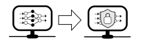

An important step for evaluating the security of systems using Artificial Intelligence (AI)- applications is to define specific security goals for the AI. With these security goals, applications may be rated and their protection needs can be determined.

Similarly to the type of classical security goals in IT security, the following security goals were derived and transferred to the field of AI.

<strong>Details about attack vector against AI applications</strong>

The attack vector against AI applications is best described using the knowledge and the skills of the attacker

### Attacker knowledge
Depending on the attacker's access to the internal information of the AI application (full, partially, none) it is referred to as "blackbox, greybox or whitebox" scenarios.
Attackers could have knowledge and access to any of the following aspects:

 1. the AI application's training data
 2. the training algorithm
 3. the AI application's trained model and its parameters

An attacker with access to all three aspects is called an attacker with "perfect knowledge". Observing such attackers allows making **worst case** assessments for the security of AI systems.

However, in practice such attackers are not realistic. Attackers with "limited knowledge" are more realistic.

### Attacker capabilities
The capabilities of an attacker can be the following, depending on the influence he has on the trained model und it's training data
| Training data | AI model |
|--|--|
|- add or delete arbitrary data points and labels|  - unlimited number of interactions after training  |
|- add or delete arbitrary data points without influencing labels|  - limited number of interactions after training|
|- modification of arbitrary or single data points |  - manipulation of the training process |
|- modification of labels of specific data points |  - influencing of training steps and future adjustments |

&nbsp;

## Integrity

Integrity of AI models means the models make the right predictions for a variety of data.

> An example would be a spam filter trained on reasonable data. It should still work correctly detecting spam, even if an attacker were to write spam mails containing many elements of a non-spam mail.

<strong>Details</strong>

Integrity in AI applications can be impaired on three different levels. 

 1. Data level: targeted corruption of data the model should predict
 2. Model level: targeted manipulation of the model's behaviour or the model's parameter.
 3. Output/Object level: targeted manipulation of reactions from the AI system towards specific model predictions.

#### Data level
On the data level, the model's inputs may be altered specifically to produce incorrect predictions.

#### Model level
On the model level, the model's parameters may be altered during or after training, producing incorrect predictions.

#### Object level
On the object level, the model's outputs may be manipulated in order to make the surrounding system react incorrectly to the input.

Integrity is also linked to **confidentiality** and **controllability**. In case of confidentiality, the attacker may achieve invalid system states due to nonsensical inputs. 
On the other hand the controllability is compromised if the attacker teaches the system unintended behaviour on the model level.

&nbsp;

## Availability

Availability in AI models ensures that the model fulfills the functionality it is used for.

> We take a look at the spam filter again. Availability aims less at declining spam (see integrity) but to ensure that all non-spam messages pass.

<strong>Details</strong>

If an attackers is targeting the availability of a model he makes the system decline harmless instances in which case the system can't work properly anymore.
If the output of an AI model is integrated into the function of the system this can be seen as a denial-of-service attack.

&nbsp;

## Confidentiality

Confidentiality describes a state in which the internal properties and confidential information on the trained model remain hidden from a potential attacker.

> The attacker should not be able to work out which words, characters or formatting the spam filter uses to detect spam.

<strong>Details</strong>

An attack on the confidentiality may allow an attacker to gather sensitive and confidential information regarding the trained AI model, its properties, structure and parameters.
With this information, the attacker could be able to steal the intellectual properties, manipulate or attack the privacy of the training data. 

&nbsp;

## Privacy

Privacy in AI applications means the protecting the privacy of training data used to train the AI model. The models should withhold all private information.

> A spam filter which was trained with private mails of Alice and Bob should not allow conclusions on what Alice or Bob wrote. Neither due to properties nor due to behaviour.

<strong>Details</strong>

In case of an attack on a model's privacy the attacker may gain information regarding the - maybe sensitive -  training data. This can lead to serious consequences for the privacy of the involved parties.
An important aspect of privacy is **anonymity** and the disctinction to **pseudonymity**. Anonymity can be defined as protections against general identification and pseudonymity as protection against identification of the name.

&nbsp;

# Assignment of security goals and concrete attacks against AI models
There are known attacks in existence against AI applications models targeting the following security goals.

|Security goal|Attacks|
|--|--|
|Integrity| Adversarial Attacken |
|Confidentiality| Data Poisoning|
|Availability| Model Stealing und Model Extraction|
|Privacy| Model Inversion, Membership Inference, Attribute Inference, Property Inference|

<strong>Details about the attacks</strong>

### Adversarial attacks

For an adversial attack, the attacker specifically manipulates a data point making the trained AI model predict said data point incorrectly.
This can be a targeted change of a pixel in an image so that the object in the picture can't be recognised anymore.

### Data Poisoning
For data poisoning, the attacker may manipulate training data while training. Therefore the quality of the model's predictions can be manipulated.
For example, an attacker can use this to bypass a spam filter. When a model was trained to associate certain words with non-spam messages an attacker can use these words to trick the model into not recognising spam.

### Model Stealing, Model Extraction
Model stealing is used to copy or steal a trained model from its original owner.

Model extraction is a special form of model stealing in which a model is stolen via blackbox access. This means an attacker only has access to an interface of the model but the received predictions are sufficient to train a substitute which
performs just like the original.

### Model Inversion
Model inversion is all about gaining information about the training data of a trained AI model.
More specifically, this means an average representation of the training data (of a certrain class) may be recovered.

### Membership Inference
Membership Inference attacks focus on the question if a given data point was used in training of the model.
This may result in a privacy problem. For example if we have a classificator that proposes treatment methods to cancer patient, we can assume it was trained on data of cancer patients.
The information of a specific data point being used in training translates to the information that the associated person has cancer.

### Attribute Inference
For attribute inference we use public available characteristics of a data point which was used to train a model and access to this model to gather information about all sensitive and private characteristics of this data point.

### Property Inference
For property inference we receive properties of the whole training set of an AI model, for example the distribution of the data.
This kind of information can lead zu privacy problems especially for minorities in the distribution.

&nbsp;

## Literature recommendations
Dario Amodei, Chris Olah, Jacob Steinhardt, Paul Christiano, John Schulman,
and Dan Mané. Concrete Problems in AI Safety. 2016. url: https://arxiv.org/pdf/1606.06565.

Marco Barreno, Blaine Nelson, Anthony D. Joseph, and J. D. Tygar. “The
security of machine learning”. In: Machine Learning 81.2 (2010), pp. 121–148.
issn: 1573-0565. doi: 10.1007/s10994-010-5188-5. url: https://link.springer.com/content/pdf/10.1007/s10994-010-5188-5.pdf.

Mark Bedner and Tobias Ackermann, “Schutzziele der IT-Sicherheit,” Datenschutz und Datensicherheit - DuD 34, no. 5 (May 2010): 323–28, doi: 10.1007/s11623-010-0096-1.

Luis Muñoz-González, Battista Biggio, Ambra Demontis, Andrea Paudice,
Vasin Wongrassamee, Emil C. Lupu, and Fabio Roli. “Towards Poisoning of
Deep Learning Algorithms with Back-gradient Optimization”. In: Proceedings
of the 10th ACM Workshop on Artificial Intelligence and Security - AISec ’17.
 pp. 27–38. isbn: 9781450352024. doi: 10.1145/3128572.3140451.

Nicolas Papernot. A Marauder’s Map of Security and Privacy in Machine Learning.url: http://arxiv.org/pdf/1811.01134v1. 2016

Nicolas Papernot, Patrick McDaniel, Ian Goodfellow, Somesh Jha, Z. Berkay
Celik, and Ananthram Swami. “Practical Black-Box Attacks against Machine
Learning”. In: Proceedings of the 2017 ACM on Asia Conference on Computerand Communications Security. Ed. by Ramesh Karri. ACM, 2017. isbn: 9781450349444. doi: 10.1145/3052973.3053009.

Nicolas Papernot, Patrick McDaniel, Arunesh Sinha, and Michael P.Wellman.
“SoK: Security and Privacy in Machine Learning”. In: 3rd IEEE European
Symposium on Security and Privacy. Los Alamitos, California: Conference
Publishing Services, IEEE Computer Society, 2018. isbn: 9781538642283. doi: 10.1109/eurosp.2018.00035.

