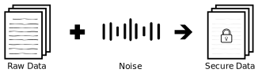
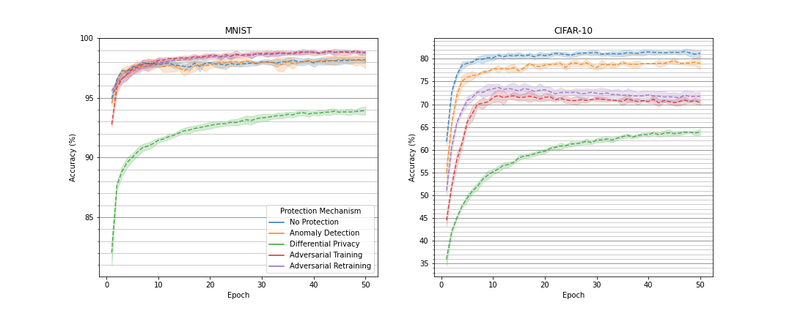
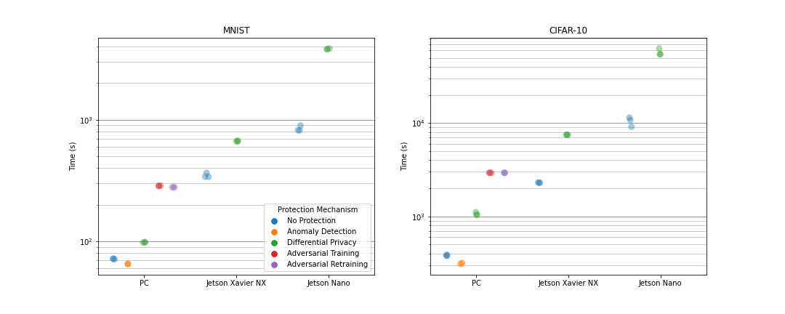
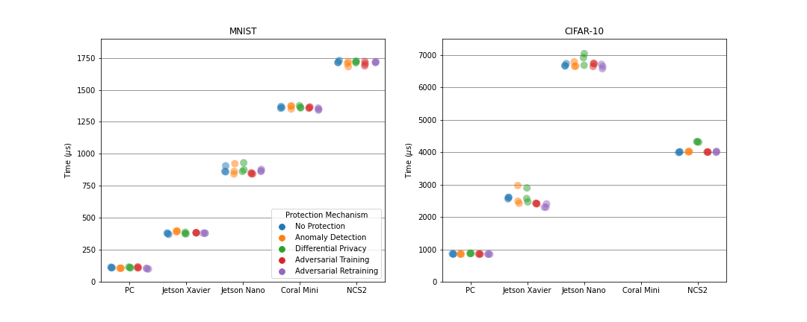

In the following, a selection of protection measures which increase the **privacy** or **integrity** of *machine
learning* (ML) models (e.g. neural networks) is presented.

First, the general training of neural networks is described since the protective measures are applied within the
training. A *neural network* is a complex mathematical function that is represented by interlinked layers which consist
of many parameters. A neural net learns to classify data points of a target data distribution by means of training data.
Here, learning refers to the adjustment of the neural net's internal parameters in an iterative process, the *training*.
Therein, the neural net classifies training data, s.t. the predicted class is propagated back through the network to
calculate the direction in which the parameters have to be adjusted in order to get close to the correct class. The
adjustment is called *gradient descent*. The training is terminated when the model's prediction quality stops improving.

 

## Adversarial Retraining
 

 
 

Adversarial Retraining is a protection measure against so-called *adversarial examples* (AE). AEs are manipulated inputs
for neural networks which aim at causing a wrong prediction. The manipulation is as subtle as human observers would not
recognize it as such. In *adversarial retraining*, AEs are integrated into the training data set of the model to protect
so that its adversarial robustness and hence its **integrity** is improved.

> One impressive example of adversarial attacks is the *one pixel attack* which only changes a single pixel of an image.
This minor perturbation is sufficient in many cases to trick the targeted neural net s.t. it predicts a wrong class.

 

<strong>Functioning</strong>

An AE can be produced within an <em>adversarial attack</em> by altering a real data point that was classified by the
target model. More precisely, the prediction is propagated back through the network up to the input data point, s.t. its
direction towards a wrong prediction can be calculated. Accordingly, the input data point is perturbed just enough to be
misclassified. Depending on the concrete kind of adversarial attack, this gradient descent within the data point is
applied differently or repeatedly. AEs are produced within adversarial retraining and together with the training data
are given to the model to train and protect.

 

<strong>Usage</strong>

Adversarial retraining cannot be applied to linear models like e.g. <em>support vector machines</em> or <em>linear
regression</em>. In contrast, neural networks acquire a significantly improved robustness against AEs when retrained
with adversarial retraining.

 

## Differential Privacy
 

 
 

*Differential Privacy* (DP) is a popular metric that allows to measure the influence of particular data points on the
result of a data processing. This is equivalent to the privacy loss of the persons to which the data belongs. The
privacy loss can be limited by inducing noise into the data processing. Although DP was originally invented in the
context of databases, it is applied to *privacy-preserving ML* in recent years.

> In 2006, the streaming service Netflix announced a public competition called *Netflix Prize*. The goal was to find the
best algorithm to predict the movie ratings of certain users. For this purpose, the streaming service provided user data
from more than 500,000 users for the training of competing algorithms. Two researchers at the University of Texas
developed a linkage attack that maps the published user data with movie ratings from IMDb, a movie rating platform. As a
result, many Netflix users have been de-anonymized.

 

<strong>Functioning</strong>

In the context of ML, <b>privacy</b> can be protected by inserting noise into the information about training data during
training of a model. More precisely, the gradient corresponding to a single data point is clipped s.t. its norm does not
exceed a certain value, and the gradient is perturbed by random noise. The combination of both techniques leads to a
reduced privacy loss and even enables the quantification of it.

 

## Homomorphic Encryption
 

 
 

*Homomorphic Encryption* (HE) enables the execution of mathematical operations like addition or multiplication on 
encrypted data. Results are still present in an encrypted form and are visible only with knowledge of the corresponding
decryption key. Note that the same results are obtained as if neither encryption nor decryption would have been applied. 

> Researchers work on practical applications of HE like, e.g., the improvement of security and transparency of
elections. Encrypted votes could be counted automatically---and therefore correctly---by means of the *Paillier crypto
system* for example. This would enable authenticity of elections while also protecting the privacy of voters.

 

<strong>Usage</strong>

HE could be used in ML to protect the <b>privacy</b> of persons whose data are used either for training of a model or
for inference by allowing models to operate on encrypted data. Unfortunately, no such technique has been developed for
neural networks so far.

 

## Anomaly Detection
 

 
 

*Anomaly detection* comprises methods to detect unusual patterns in data. Critical inputs like AEs can be filtered out of
training data by means of anomaly detection. This leads to an improved robustness and thus to the **integrity** of ML
models.

> Anomaly detection is applied in many areas like for example text and image processing, fraud detection, or medicine.

 

<strong>Usage</strong>

Usually, anomaly detection is applied to improve the robustness of neural networks by using a second neural network that
detects and removes critical inputs. This method requires additional computing resources. As an alternative to
protecting the robustness and <b>integrity</b>, anomaly detection can be used to improve the <b>privacy</b> protection
of training data in ML. Thus, membership inference attacks can be used to remove highly vulnerable data from the
training dataset.

 

## Evaluation
In order to compare the different protection measures and to evaluate their suitability in the context of resource
constrained embedded and mobile AI, several ML experiments were conducted. Therein, neural networks were trained each
with one or without any protection mechanism on the MNIST or CIFAR-10 dataset. The *MNIST* dataset contains 70.000
gray-scaled images of hand-written digits. In contrast, the *CIFAR-10* dataset comprises 60,000 colored images of animals
or vehicles. For the MNIST dataset, a *multi-layer perceptron* (MLP) consisting of about 670,000 adjustable parameters
was used, while a *convolutional neural network* (CNN) was selected for the CIFAR-10 dataset that consists of
approximately 5.8 mio. parameters. The models were trained over 50 epochs and afterwards deployed on different embedded
devices to infer 10,000 test data points. For the inference, the most accurate version of a model over all training
epochs was selected to classify the test data.

 

<link rel="stylesheet" href="/css/style.css">

<!-- Header -->

<h3 style="text-align:center">
Comparison of Prediction Quality
</h3>

<text><i>
The chart shows the course of the test accuracy (prediction quality) for each protection mechanism on each dataset. On
each dataset, the accuracy of models trained with differential privacy is the worst. ML models without protection
measure similarly achieve a high accuracy on each dataset. Adversarial Training and retraining influences the accuracy
positively on the MNIST dataset while they lead to a decreased accuracy on the CIFAR-10 dataset.
</i></text>
 
 
 
 
 

<h3 style="text-align:center">
Comparison of Training Time
</h3>

<text><i>
Embedded and mobile devices have lower computational power compared to desktop PCs, rack servers, or computing clusters.
Therefore, the training of neural networks is executed on one of the latter machines. Nevertheless, some embedded
devices like the Jetsons of Nvidia enable training. The following chart shows the training time of the different ML
experiments on two different Jetson devices and on a desktop PC. The training time is expressed in seconds on a
logarithmic scale. Trainings without protection measure and with anomaly detection require approximately the same time,
while differential privacy leads to significantly higher times. Adversarial training in turn requires a multiple of that
training time. Furthermore, there are large differences between different devices. The Jetson Nano is way slower than
the Jetson Xavier NX, which in turn is substantially slower than the desktop PC. Note that the installation of many code
libraries is very difficult on the Jetson devices, wherefore the protection mechanisms anomaly detection and adversarial
(re)training were not applied on them.
</i></text>

<h3 style="text-align:center">
Comparison of Inference Time
</h3>

<text><i>
The trained ML models were deployed on different devices to infer each of the 10,000 test samples of each dataset. The
average inference time in milliseconds per data point is illustrated in the following chart. A clear order between the
devices PC, Jetson Xavier NX, Jetson Nano, Coral Dev Board Mini, and Neural Compute Stick 2 (NCS2) can be recognized for
the simpler MNIST dataset, where the protection measures do not have any influence on the inference time. On the more
complex CIFAR-10 dataset, the NCS2 is faster than the Jetson Nano. Further, the inference of models protected by
differential privacy is slightly slower than others. This is due to a replaced model layer in the CNN so that
differential privacy can be tracked. Unfortunately, no CIFAR-10 experiments could be executed on the Coral Dev Board
Mini since the CNN could not have been compiled for its inference chip named Edge TPU.
</i></text>
 
 

<a class="prev" onclick="plusSlides(-1)">&#10094;</a>
<a class="next" onclick="plusSlides(1)">&#10095;</a>

  
  
  

<!-- Javascript -->

## Literaturempfehlungen

Goodfellow, I. J., Shlens, J., and Szegedy, C. "Explaining and Harnessing Adversarial Examples" in ICLR (2015).

Abadi, M., Chu, A., Goodfellow, I. J., McMahan, H. B., Mironov, I., Talwar, K., and Zhang, L. "Deep Learning with
Differential Privacy" in ACM CCS (2016).

Acar, A., Aksu, H., Uluagac, A. S., and Conti, M. "A Survey on Homomorphic Encryption Schemes: Theory and
Implementation" in ACM CSUR (2018).

Chandola, V., Banerjee, A., and Kumar, V. "Anomaly Detection: A Survey" in ACM CSUR (2009).
